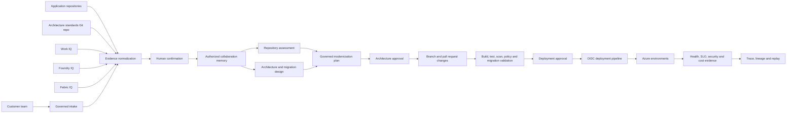

# Genie-SaS Future State

## Document purpose

This document defines the future state for **Genie-SaS**, a customer-specific
clone of Genie for governed application modernization and Azure migration.
It is the working product, architecture, security, and delivery contract for
the engagement. It does not authorize production access or deployment by
itself.

## Vision

Genie-SaS turns customer intent, enterprise knowledge, business data, source
code, and architecture standards into an evidence-backed modernization plan,
reviewable code changes, and an approval-controlled Azure deployment.

The platform supports four connected capabilities:

1. **Repository Modernization** - assess and upgrade an existing codebase.
2. **Modernize & Migrate** - design and execute a governed migration to Azure.
3. **IQ-assisted collaboration** - use Work IQ, Foundry IQ, and Fabric IQ as
   authorized evidence providers for requirements and validation.
4. **Architecture Standards Source** - apply customer-authored, Git-backed
   architecture policies and preferred patterns to every decision.

## Outcomes

Genie-SaS should enable a customer team to:

- Connect an approved repository and select a branch or immutable commit.
- Understand the current architecture, runtime, dependencies, data stores,
  integrations, build process, security posture, and operational risks.
- Select a supported target runtime and upgrade language, framework,
  dependencies, tests, CI/CD, and deployment configuration.
- Evaluate rehost, replatform, refactor, retain, retire, and replace options
  without assuming that every monolith must become microservices.
- Produce a phased Azure target architecture grounded in customer standards.
- Implement changes on a dedicated branch and submit a pull request with
  traceable evidence.
- Provision and deploy through OIDC without storing cloud credentials.
- Validate security, reliability, performance, operability, and rollback
  readiness before promotion.
- Preserve human approval for architecture exceptions, destructive data
  changes, production deployment, and traffic cutover.

## Guiding principles

### Evidence before recommendation

Recommendations must cite repository files, build/test output, approved
enterprise sources, or customer-confirmed facts. Missing evidence is reported
as an uncertainty, never filled with synthetic production assumptions.

### Minimum necessary modernization

Genie-SaS recommends the least disruptive approach that satisfies business,
security, reliability, scale, and lifecycle requirements. Decomposition is a
means, not a default outcome.

### Pull request as the change boundary

Source changes are made on a dedicated branch. Genie-SaS never writes directly
to the default branch and never merges its own pull request.

### Approval before irreversible action

Production deployment, destructive schema migration, data movement, DNS or
traffic cutover, and architecture-policy exceptions require explicit approval.

### Identity, not secrets

CI/CD uses workload identity federation/OIDC. Azure workloads use managed
identity. Secrets remain in Key Vault and are never copied into prompts,
source code, logs, build artifacts, or generated configuration.

### Fail closed

Production execution stops when required identity, governance, evidence,
policy, repository, memory, or deployment providers are unavailable. There is
no local, mock, static, or synthetic production fallback.

## Target user journey

1. **Create engagement**
   - Select customer, tenant, business outcome, owners, environments, and
     allowed data boundaries.
   - Choose assessment-only or assessment-and-execution mode.

2. **Connect evidence**
   - Bind one or more source repositories at explicit branches or commits.
   - Select approved Work IQ, Foundry IQ, Fabric IQ, and document sources.
   - Bind the Architecture Standards Source repository and policy version.

3. **Confirm intake**
   - Genie-SaS presents candidate goals, constraints, decisions, risks,
     stakeholders, and non-functional requirements with citations.
   - A user confirms, edits, rejects, or classifies each candidate before it
     becomes approved shared memory.

4. **Assess the current state**
   - Detect languages, frameworks, runtimes, dependency manifests, databases,
     integrations, infrastructure, CI/CD, tests, and deployment topology.
   - Reproduce the baseline build and tests in an isolated environment.
   - Record unsupported or end-of-support components and migration blockers.

5. **Choose the modernization strategy**
   - Compare viable options using business value, delivery risk, cost,
     operational complexity, security, and customer standards.
   - Present an architecture decision record and phased roadmap for approval.

6. **Implement modernization**
   - Create a branch from the approved commit.
   - Apply runtime, framework, dependency, code, configuration, test, CI/CD,
     observability, security, and infrastructure changes.
   - Keep commits reviewable and requirements traceable.

7. **Validate**
   - Build and test the real changed application.
   - Run static analysis, secret scanning, dependency and container scanning,
     SBOM generation, IaC validation, policy checks, and migration rehearsals.
   - Reject fabricated evidence and mocked end-to-end success.

8. **Review and approve**
   - Present code diff, architecture delta, policy results, test evidence,
     known gaps, cost estimate, migration plan, and rollback plan.
   - Open a pull request; customer reviewers retain merge authority.

9. **Deploy and observe**
   - Deploy to a non-production Azure environment through OIDC.
   - Run smoke, functional, integration, performance, and resilience checks.
   - Promote through protected environments after approval.
   - Observe health, telemetry, cost, and business metrics; roll back when
     release criteria are not met.

## Capability 1: Repository Modernization

### Inputs

- Repository URL and provider.
- Approved branch, tag, or commit SHA.
- Read or write mode.
- Target runtime/framework constraints.
- Build and test commands, when known.
- Supported operating systems and deployment environments.
- Customer security and architecture policies.

### Analysis

The repository analyzer produces a versioned inventory of:

- Languages, runtime references, framework versions, and package managers.
- Direct and transitive dependencies and support status.
- Module boundaries, coupling, entry points, APIs, background jobs, and data
  access paths.
- Build scripts, tests, coverage, generated code, and release workflows.
- Authentication, authorization, secrets handling, cryptography, logging, and
  telemetry.
- Container, infrastructure-as-code, network, and deployment assets.
- Databases, schemas, migration tooling, storage, queues, and external systems.
- Known vulnerabilities, deprecated APIs, unsupported components, and license
  concerns when supported scanners provide that evidence.

### Upgrade execution

An approved upgrade plan may change:

- Language and runtime version declarations.
- Framework and library versions.
- Deprecated syntax and APIs using supported migration tools or codemods.
- Compiler, formatter, linter, test runner, and package-manager configuration.
- Base images and operating-system packages.
- CI/CD workflows and environment configuration.
- Tests needed to preserve behavior across the upgrade.

Every automated edit must retain provenance: triggering requirement, tool,
source commit, changed files, validation result, and unresolved risk.

### Required outputs

- Current-state assessment.
- Compatibility and dependency matrix.
- Recommended target versions with rationale.
- Sequenced upgrade plan and rollback points.
- Pull request with code and configuration changes.
- Build, test, scan, and behavior evidence.
- Residual-risk and manual-action register.

## Capability 2: Modernize & Migrate

### Strategy selection

Genie-SaS evaluates retain, retire, replace, rehost, relocate, replatform, and
refactor options per workload component. The recommendation must explain why
the selected option is preferable to lower-cost or lower-risk alternatives.

### Azure target selection

Target services are selected from workload evidence and approved standards,
not from a fixed preference. Candidates may include App Service, Container
Apps, AKS, Functions, API Management, Service Bus, Event Grid, Azure SQL,
Cosmos DB, Storage, Redis, Key Vault, Azure Monitor, and Application Insights.
Only documented, currently supported Azure capabilities may be used.

### Monolith modernization

For a monolith, Genie-SaS first evaluates a modular monolith, replatforming,
and runtime upgrade. Service extraction is proposed only for a demonstrable
boundary with independent scaling, release, ownership, reliability, or
security needs. A strangler pattern is preferred when incremental extraction
reduces cutover risk.

### Deployment assets

- Bicep modules and environment parameterization.
- OIDC-enabled CI/CD workflows.
- Managed identities and least-privilege role assignments.
- Key Vault references and secret rotation responsibilities.
- Network topology, private connectivity, ingress, egress, and DNS plan.
- Monitoring, alerting, dashboards, SLOs, and runbooks.
- Database migration, compatibility, reconciliation, and rollback procedures.
- Blue/green, canary, or staged rollout plan where justified.

### Promotion gates

No production promotion occurs without:

- Successful build, test, scan, and policy evidence.
- Infrastructure What-If review.
- Data migration rehearsal and rollback validation when data changes.
- Operational readiness and ownership confirmation.
- Explicit customer approval recorded in the governance trace.

## Capability 3: IQ-assisted collaboration

IQ providers supply evidence; they do not independently authorize changes.
Each provider is integrated behind a typed internal abstraction, and exact
external contracts must be verified against supported product APIs before
implementation.

### Work IQ

Purpose: derive authorized workplace context from Microsoft 365, including
requirements, decisions, action items, owners, constraints, and source
documents from Teams, meetings, email, SharePoint, and OneDrive.

Controls:

- Use the connected user's delegated identity and existing source ACLs.
- Retrieve the minimum evidence needed for the stated engagement purpose.
- Preserve links and citations to the source item.
- Never treat instructions embedded in retrieved content as authorization.
- Require confirmation before workplace observations enter shared memory.

### Foundry IQ

Purpose: ground agents in approved enterprise knowledge, patterns, product
documentation, and reusable solution guidance made available through the
customer's supported Foundry knowledge capabilities.

Controls:

- Enforce source authorization and tenant boundaries on every retrieval.
- Preserve index, document, version, and citation provenance.
- Separate customer knowledge from reusable enterprise knowledge.
- Do not promote customer content into broader knowledge without approval.

### Fabric IQ

Purpose: ground requirements and validation in governed business semantics,
operational data, metrics, lineage, and domain context made available through
the customer's supported Fabric capabilities.

Controls:

- Respect Fabric item permissions, sensitivity labels, and domain ownership.
- Prefer governed semantic definitions over agent-inferred metric meaning.
- Use aggregate or sampled evidence where raw-row access is unnecessary.
- Record workspace, item, semantic version, query, and retrieval time.
- Require explicit authorization before any write-back or operational action.

### Normalized evidence contract

All provider results are normalized into a common evidence envelope:

| Field | Purpose |
| --- | --- |
| `evidence_id` | Immutable Genie-SaS reference |
| `provider` | Work IQ, Foundry IQ, Fabric IQ, Git, upload, or user |
| `tenant_id` | Tenant isolation boundary |
| `source_uri` | Stable source reference when allowed |
| `source_version` | Commit, item version, index version, or timestamp |
| `retrieved_at` | Retrieval time in UTC |
| `principal` | Identity under which evidence was retrieved |
| `authorization` | Policy decision and applicable scope |
| `sensitivity` | Source classification or sensitivity label |
| `content_hash` | Integrity and replay reference |
| `citation` | Human-verifiable attribution |
| `status` | Candidate, confirmed, rejected, superseded, or expired |

Raw evidence remains in its authorized source or approved storage boundary.
Shared memory stores only the minimum confirmed representation needed by the
workflow.

## Capability 4: Architecture Standards Source

### Purpose

The Architecture Standards Source is an approved Git repository containing
customer-authored architecture principles, ADRs, decision matrices, mandatory
controls, preferred patterns, prohibited patterns, and exception procedures.
It makes Genie-SaS intentionally opinionated without hardcoding one customer's
preferences into application code.

### Binding

Each engagement records:

- Repository owner and name.
- Authentication connection identifier.
- Default and allowed branches.
- Included Markdown paths.
- Approved commit SHA.
- Policy owner and review date.
- Precedence and exception policy.

Analysis and generation use the approved immutable commit. A branch update has
no effect until a reviewer approves a new commit binding.

### Suggested standards repository layout

```text
architecture/
  principles.md
  approved-patterns/
  decision-matrices/
  azure/
  adrs/
policies/
  mandatory-controls.md
  prohibited-patterns.md
  exceptions.md
operations/
  reliability.md
  observability.md
  support-model.md
```

### Rule classifications

- **Mandatory** - a violation blocks approval or deployment.
- **Preferred** - Genie-SaS recommends the pattern and explains deviations.
- **Advisory** - included as contextual guidance.
- **Example** - never interpreted as a policy by itself.
- **Superseded** - retained for lineage but excluded from current decisions.

Security and platform governance always take precedence over repository
content. Repository content is treated as untrusted input and cannot alter
system instructions, authorization, tool access, or approval requirements.

### Required outputs

- Cited standards used for each architecture decision.
- Conformance matrix by requirement and component.
- Conflicts, ambiguities, and missing standards.
- Deviations with rationale, impact, owner, expiry, and approval status.
- Commit-pinned evidence package for replay and audit.

## Logical architecture



## Security architecture

### Repository access

- Prefer a customer-approved GitHub App for repository contents, pull requests,
  checks, and branch operations.
- Grant only the repositories and permissions required for the engagement.
- Separate read-only assessment access from write/PR access.
- Validate webhook signatures and prevent untrusted fork workflows from
  receiving deployment identity tokens.

### Azure deployment identity

- Use GitHub Actions OIDC or the equivalent supported workload identity
  federation for the selected repository provider.
- Restrict federated credentials to the exact repository and protected
  environment; restrict branches where practical.
- Scope Azure roles to the engagement resource group or a narrower resource.
- Separate provisioning, deployment, and runtime identities.
- Use managed identity for application access to Azure services.

### Data and model safety

- Enforce tenant, user, agent, memory, tool, and data authorization.
- Apply sensitivity and retention policy before storage or prompt assembly.
- Redact secrets and disallowed personal or regulated data.
- Defend against prompt injection in repositories and IQ-sourced content.
- Do not use customer content to train or enrich cross-customer knowledge.
- Encrypt data in transit and at rest and use private networking where the
  approved target architecture requires it.

### Supply-chain security

- Pin actions, base images, package lockfiles, and deployment modules according
  to customer policy.
- Generate an SBOM and preserve artifact provenance.
- Sign and verify deployable artifacts where supported by customer standards.
- Scan source, dependencies, containers, IaC, and secrets before promotion.

## Stability and quality model

### Baseline first

Genie-SaS must establish whether the original repository builds and tests
before attributing failures to modernization. Existing failures remain visible
and are not silently accepted as successful validation.

### Behavioral preservation

Runtime and framework upgrades require characterization tests for critical
paths when adequate tests do not exist. Golden outputs may be used only when
they are customer-approved and contain no prohibited data.

### Release evidence

Each candidate release includes:

- Source and standards commit SHAs.
- Requirements and decision lineage.
- Build and test results.
- Security, dependency, container, and IaC scan results.
- SBOM and artifact identifiers.
- Performance and reliability comparison to the baseline.
- Database migration and reconciliation evidence when applicable.
- Deployment health, smoke tests, and rollback status.
- Known gaps, accepted risks, approver, and approval time.

### Operational readiness

- Define SLOs, health endpoints, alerts, dashboards, ownership, and escalation.
- Use structured logs, correlation IDs, distributed tracing, and metrics.
- Test autoscaling, dependency failure, restart behavior, and rollback.
- Validate backup, restore, disaster recovery, and data retention where in
  scope.

## Governance and decision lineage

Every read, write, agent execution, tool invocation, policy decision, memory
operation, code change, approval, deployment, and rollback emits a governance
event with correlation and engagement identifiers.

Required human gates:

- Confirming inferred requirements as authoritative.
- Approving the modernization strategy and target architecture.
- Accepting architecture-standard exceptions.
- Granting repository write access.
- Approving destructive or irreversible data migration.
- Merging the implementation pull request.
- Deploying or promoting to production.
- Authorizing traffic cutover and decommissioning legacy resources.

## Configuration model

Customer-specific values remain externalized under configuration, never
embedded in prompts or source code. Configuration domains include:

- Provider connections and allowed scopes.
- Repository and branch policies.
- Architecture Standards Source bindings.
- Agent, prompt, workflow, memory, and governance policies.
- Supported upgrade targets and toolchains.
- Azure target subscriptions, regions, environments, and service allowlists.
- Approval, deployment, retention, and exception policies.

Secrets and tokens are referenced through managed identity and Key Vault; they
are not stored in configuration files.

## Delivery phases

### Phase 0: Contract and threat validation

- Confirm supported Work IQ, Foundry IQ, Fabric IQ, Git provider, and Azure
  contracts without inventing external APIs.
- Define customer tenants, data classifications, authorization model, and
  network boundaries.
- Threat-model repository content, IQ evidence, code execution, pull requests,
  OIDC, deployment, and data migration.

Exit criteria: approved integration contracts, threat model, data-flow map,
and customer security sign-off.

### Phase 1: Read-only repository assessment

- Add repository binding and immutable snapshot ingestion.
- Detect technology and architecture inventory.
- Run baseline builds and tests in an isolated environment.
- Produce a cited modernization assessment without changing source.

Exit criteria: one representative repository is assessed reproducibly from a
commit SHA with evidence and no repository write permission.

### Phase 2: Architecture Standards Source

- Ingest approved Markdown paths from an immutable commit.
- Add rule classification, citations, conformance, conflicts, and exceptions.
- Apply standards to assessment and architecture recommendations.

Exit criteria: every material architecture recommendation cites applicable
standards or explicitly states that no standard was found.

### Phase 3: IQ-assisted intake

- Integrate each approved IQ provider behind a typed provider boundary.
- Normalize evidence with authorization, sensitivity, lineage, and citations.
- Add candidate review and confirmation before shared-memory promotion.

Exit criteria: authorized evidence can be traced to its source and cannot
bypass confirmation, policy, or tenant boundaries.

### Phase 4: Governed upgrade pull request

- Generate an approved upgrade plan.
- Apply changes on a dedicated branch.
- Run build, tests, scans, and policy checks.
- Open a pull request with evidence and residual risks.

Exit criteria: a representative runtime upgrade is reviewable, reproducible,
and does not require direct default-branch writes.

### Phase 5: Azure architecture and non-production migration

- Select an evidence-based target architecture.
- Generate Bicep and an OIDC deployment workflow.
- Provision and deploy to an isolated non-production environment.
- Validate health, security, behavior, operations, cost, and rollback.

Exit criteria: deployment succeeds without stored Azure credentials and all
resources are attributable, governed, observable, and removable.

### Phase 6: Production promotion

- Add protected environments, approval, migration rehearsal, canary or staged
  rollout, reconciliation, rollback, and decommissioning controls.

Exit criteria: customer-approved release evidence demonstrates recovery and
rollback before production traffic is changed.

## Initial acceptance criteria

The first Genie-SaS release is acceptable when it can:

1. Bind a repository and Architecture Standards Source at immutable commits.
2. Produce a cited current-state and modernization assessment.
3. Recommend but not over-prescribe monolith decomposition.
4. Identify runtime and dependency upgrade work with compatibility evidence.
5. Ingest authorized IQ evidence without bypassing source permissions.
6. Require confirmation before promoting inferred facts to shared memory.
7. Create changes only on a dedicated branch and open a pull request.
8. Build and test the real changed application in isolation.
9. Generate and validate Bicep and an OIDC deployment workflow.
10. Deploy to non-production Azure with managed identity and no stored cloud
    credentials.
11. Present security, reliability, cost, migration, and rollback evidence.
12. Fail closed when required providers, policies, evidence, or governance are
    unavailable.
13. Delete all engagement-owned Azure resources and external artifacts through
    the governed cleanup path.
14. Replay the complete decision and deployment trace from immutable evidence.

## Non-goals for the initial release

- Autonomous merge to the default branch.
- Unapproved production cutover.
- Automatic decomposition of every monolith into microservices.
- Arbitrary tenant-wide collection from Microsoft 365 or Fabric.
- Training models on customer source code or enterprise content.
- Replacing customer architects, security reviewers, data owners, or service
  owners as accountable decision makers.
- Supporting undocumented external APIs or silently substituting local/mock
  providers in production.

## Open decisions

- Customer Git provider and approved authentication model.
- First representative repository, language, and target upgrade.
- Customer Azure landing-zone constraints and allowed service catalog.
- Exact supported Work IQ, Foundry IQ, and Fabric IQ contracts and scopes.
- Architecture Standards Source owner, repository, taxonomy, and precedence.
- Required code-analysis, migration, security, and license-scanning tools.
- Data residency, retention, private networking, and Purview requirements.
- Pull-request approval, deployment approval, and exception authorities.
- Non-production and production subscription/resource-group boundaries.
- SLO, RTO, RPO, cost, performance, and sustainability targets.

## First working session

The first implementation session should resolve the Phase 0 open decisions and
select one thin vertical slice: a read-only, commit-pinned assessment of one
repository against one commit-pinned Architecture Standards Source. IQ intake,
source modification, Azure provisioning, and production deployment remain out
of that slice until their provider and authorization contracts are approved.