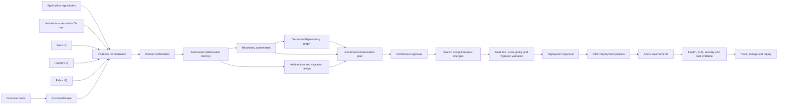

# Genie-SaS Future State

## Document purpose

This document defines the future state for **Genie-SaS**, a customer-specific
clone of Genie for governed application modernization and Azure migration.
It is the working product, architecture, security, and delivery contract for
the engagement. It does not authorize production access or deployment by
itself.

## Vision

Genie-SaS turns customer intent, enterprise knowledge, business data, source
code, and architecture standards into an evidence-backed modernization plan,
reviewable code changes, and an approval-controlled Azure deployment.

The platform supports five connected capabilities:

1. **Repository Modernization** - assess and upgrade an existing codebase.
2. **Code Dependency Mapping** - derive an evidence-backed dependency graph
   from an approved repository snapshot.
3. **Modernize & Migrate** - design and execute a governed migration to Azure.
4. **IQ-assisted collaboration** - use Work IQ, Foundry IQ, and Fabric IQ as
   authorized evidence providers for requirements and validation.
5. **Architecture Standards Source** - apply customer-authored, Git-backed
   architecture policies and preferred patterns to every decision.

## Outcomes

Genie-SaS should enable a customer team to:

- Connect an approved repository and select a branch or immutable commit.
- Understand the current architecture, runtime, dependencies, data stores,
  integrations, build process, security posture, and operational risks.
- Visualize code, package, data, service, infrastructure, and external-system
  dependencies with file-level evidence and impact paths.
- Select a supported target runtime and upgrade language, framework,
  dependencies, tests, CI/CD, and deployment configuration.
- Evaluate rehost, replatform, refactor, retain, retire, and replace options
  without assuming that every monolith must become microservices.
- Produce a phased Azure target architecture grounded in customer standards.
- Implement changes on a dedicated branch and submit a pull request with
  traceable evidence.
- Provision and deploy through OIDC without storing cloud credentials.
- Validate security, reliability, performance, operability, and rollback
  readiness before promotion.
- Preserve human approval for architecture exceptions, destructive data
  changes, production deployment, and traffic cutover.

## Guiding principles

### Evidence before recommendation

Recommendations must cite repository files, build/test output, approved
enterprise sources, or customer-confirmed facts. Missing evidence is reported
as an uncertainty, never filled with synthetic production assumptions.

### Minimum necessary modernization

Genie-SaS recommends the least disruptive approach that satisfies business,
security, reliability, scale, and lifecycle requirements. Decomposition is a
means, not a default outcome.

### Pull request as the change boundary

Source changes are made on a dedicated branch. Genie-SaS never writes directly
to the default branch and never merges its own pull request.

### Approval before irreversible action

Production deployment, destructive schema migration, data movement, DNS or
traffic cutover, and architecture-policy exceptions require explicit approval.

### Identity, not secrets

CI/CD uses workload identity federation/OIDC. Azure workloads use managed
identity. Secrets remain in Key Vault and are never copied into prompts,
source code, logs, build artifacts, or generated configuration.

### Fail closed

Production execution stops when required identity, governance, evidence,
policy, repository, memory, or deployment providers are unavailable. There is
no local, mock, static, or synthetic production fallback.

## Target user journey

1. **Create engagement**
   - Select customer, tenant, business outcome, owners, environments, and
     allowed data boundaries.
   - Choose assessment-only or assessment-and-execution mode.

2. **Connect evidence**
   - Bind one or more source repositories at explicit branches or commits.
   - Register an approved repository MCP connection, select authorized
     repositories, and assign each binding a code, architecture, or standards
     purpose.
   - Select approved Work IQ, Foundry IQ, Fabric IQ, and document sources.
   - Bind the Architecture Standards Source repository and policy version.

3. **Confirm intake**
   - Genie-SaS presents candidate goals, constraints, decisions, risks,
     stakeholders, and non-functional requirements with citations.
   - A user confirms, edits, rejects, or classifies each candidate before it
     becomes approved shared memory.

4. **Assess the current state**
   - Detect languages, frameworks, runtimes, dependency manifests, databases,
     integrations, infrastructure, CI/CD, tests, and deployment topology.
   - Build a queryable dependency graph from the commit-pinned source,
     manifests, configuration, schemas, infrastructure, and workflow files.
   - Reproduce the baseline build and tests in an isolated environment.
   - Record unsupported or end-of-support components and migration blockers.

5. **Choose the modernization strategy**
   - Compare viable options using business value, delivery risk, cost,
     operational complexity, security, and customer standards.
   - Present an architecture decision record and phased roadmap for approval.

6. **Implement modernization**
   - Create a branch from the approved commit.
   - Apply runtime, framework, dependency, code, configuration, test, CI/CD,
     observability, security, and infrastructure changes.
   - Keep commits reviewable and requirements traceable.

7. **Validate**
   - Build and test the real changed application.
   - Run static analysis, secret scanning, dependency and container scanning,
     SBOM generation, IaC validation, policy checks, and migration rehearsals.
   - Reject fabricated evidence and mocked end-to-end success.

8. **Review and approve**
   - Present code diff, architecture delta, policy results, test evidence,
     known gaps, cost estimate, migration plan, and rollback plan.
   - Open a pull request; customer reviewers retain merge authority.

9. **Deploy and observe**
   - Deploy to a non-production Azure environment through OIDC.
   - Run smoke, functional, integration, performance, and resilience checks.
   - Promote through protected environments after approval.
   - Observe health, telemetry, cost, and business metrics; roll back when
     release criteria are not met.

## Experience entry options

The Genie landing page presents four peer experience options. Each option
creates or resumes its own typed run within an engagement instead of forcing
every user through one long workflow:

| Option | Primary input | Primary outcome |
| --- | --- | --- |
| **Discovery** | Transcripts, recordings, documents, and authorized IQ evidence | Confirmed requirements, constraints, risks, and candidate solution direction |
| **Repository Modernization** | Approved repository snapshot and target runtime constraints | Current-state assessment and governed upgrade plan or pull request |
| **Dependency Mapping** | Approved repository snapshot and optional authorized telemetry | Versioned dependency graph, integration context, and change-impact analysis |
| **Modernize & Migrate** | Approved assessment, dependency map, requirements, and Azure constraints | Target architecture, migration waves, deployment assets, and promotion evidence |

These options are independently usable but composable:

- A user can start Dependency Mapping without first running Discovery.
- Repository Modernization can consume an approved dependency-map version
  when one exists, but it does not silently trigger or assume that analysis.
- Modernize & Migrate can consume approved outputs from Discovery, Repository
  Modernization, and Dependency Mapping, with every input version shown before
  the run starts.
- A user can hand off an approved output to another option without copying
  content between sessions; Genie records the source run, version, approval,
  and evidence lineage.
- Missing upstream evidence is presented as an explicit gap. An option can
  proceed only when its configured policy permits the gap and the user
  confirms it.

Each option has its own intake form, progress view, result workspace, resume
list, status, permissions, retention policy, and workflow definition. All
options share the same session identity, evidence envelope, governance trace,
memory authorization, AzureAgentGateway, model policy, and approval services.
Selecting an option never changes production authorization or grants
repository write or Azure deployment access.

For the prototype, the landing page replaces capability-specific buttons with
an experience-card selector and a common session name and approved model
policy. Selecting a card routes to that experience's intake page. Saved runs
are grouped by experience and can be resumed from the landing page. The
configured GPT-5-1.Mini deployment remains the default enrichment model for
the three repository experiences; deterministic analyzers and deployment
pipelines remain model-independent.

## Capability 1: Repository Modernization

### Inputs

- Repository URL and provider.
- Approved branch, tag, or commit SHA.
- Read or write mode.
- Target runtime/framework constraints.
- Build and test commands, when known.
- Supported operating systems and deployment environments.
- Customer security and architecture policies.

### Analysis

The repository analyzer produces a versioned inventory of:

- Languages, runtime references, framework versions, and package managers.
- Direct and transitive dependencies and support status.
- Module boundaries, coupling, entry points, APIs, background jobs, and data
  access paths.
- Build scripts, tests, coverage, generated code, and release workflows.
- Authentication, authorization, secrets handling, cryptography, logging, and
  telemetry.
- Container, infrastructure-as-code, network, and deployment assets.
- Databases, schemas, migration tooling, storage, queues, and external systems.
- Known vulnerabilities, deprecated APIs, unsupported components, and license
  concerns when supported scanners provide that evidence.

### Upgrade execution

An approved upgrade plan may change:

- Language and runtime version declarations.
- Framework and library versions.
- Deprecated syntax and APIs using supported migration tools or codemods.
- Compiler, formatter, linter, test runner, and package-manager configuration.
- Base images and operating-system packages.
- CI/CD workflows and environment configuration.
- Tests needed to preserve behavior across the upgrade.

Every automated edit must retain provenance: triggering requirement, tool,
source commit, changed files, validation result, and unresolved risk.

### Required outputs

- Current-state assessment.
- Compatibility and dependency matrix.
- Recommended target versions with rationale.
- Sequenced upgrade plan and rollback points.
- Pull request with code and configuration changes.
- Build, test, scan, and behavior evidence.
- Residual-risk and manual-action register.

## Capability 2: Code Dependency Mapping

### Purpose

Code Dependency Mapping turns an approved, commit-pinned repository snapshot
into a versioned graph of components and their relationships. The graph helps
teams understand coupling, ownership, change impact, migration order, security
exposure, and candidate modernization boundaries without assuming that static
analysis can prove every runtime interaction.

### Evidence sources

The mapper analyzes only authorized repository content and approved tool
output, including:

- Source imports, calls, inheritance, implementations, entry points, and
  generated-code markers.
- Package manifests, lockfiles, project references, and resolved direct and
  transitive package dependencies.
- API specifications, routes, clients, service discovery, messaging topics,
  queues, events, scheduled jobs, and background workers.
- Database schemas, migrations, queries, stored procedures, data-access
  configuration, and storage bindings.
- Infrastructure-as-code, containers, deployment descriptors, environment
  variable references, and CI/CD workflows.
- Test fixtures, integration tests, build traces, and runtime telemetry only
  when separately authorized and available.

### Graph model

Each node has a stable identifier, type, repository-relative location,
technology, owner when evidenced, source commit, and sensitivity metadata.
Node types include repository, solution, project, module, component, API,
job, datastore, package, infrastructure resource, pipeline, and external
system.

Each directed edge records a typed relationship such as imports, calls,
implements, publishes, subscribes, reads, writes, deploys, configures, builds,
tests, or depends on. It also records source evidence, detection method,
confidence, and whether the relationship is statically observed,
dynamically observed, declared, or inferred.

### Analysis and interaction

The dependency map must support:

- Filtering and traversal by component, dependency type, environment,
  ownership, sensitivity, and confidence.
- Direct and transitive upstream and downstream impact analysis.
- Cycle, hotspot, fan-in, fan-out, shared-database, and cross-boundary
  coupling detection.
- Identification of unowned, unsupported, vulnerable, or
  end-of-support dependencies when supported evidence is available.
- Comparison between source commits to show added, removed, and changed nodes
  and edges.
- Candidate extraction boundaries and migration waves with cited rationale;
  these remain recommendations until approved.
- Export of a machine-readable graph and a human-reviewable visualization
  without exposing secrets or disallowed source content.

Missing, reflective, dynamically loaded, generated, or runtime-only
relationships are reported as coverage gaps. Low-confidence inferences are
visually distinct and cannot be presented as confirmed facts.

### Integration context graph

For any selected integration or dependency, Genie-SaS presents a contextual
subgraph rather than only a package or call hierarchy. The context graph
combines the selected node with the evidence-backed information needed to
understand why it exists, how it is used, and what may be affected by a
change.

The context graph may include:

- Upstream callers, downstream services, transitive dependencies, and
  repository locations.
- APIs, operations, routes, events, queues, topics, jobs, protocols, and data
  formats involved in the interaction.
- Authentication method, authorization boundary, managed identity, secret
  reference, network path, and trust boundary when evidenced.
- Datastores and data entities read or written, including sensitivity,
  residency, and ownership metadata when authorized.
- Configuration keys, feature flags, environment bindings, infrastructure
  resources, deployment units, pipelines, and runtime environments.
- Business capability, requirement, architecture decision, team ownership,
  operational SLO, and approved standard linked through governed evidence.
- Tests, monitors, alerts, traces, vulnerabilities, support status, and known
  incidents associated with the integration when approved sources provide
  that evidence.
- Change-impact paths, migration constraints, replacement candidates, and
  unresolved questions.

Users can expand or collapse graph layers, follow upstream and downstream
paths, filter by environment and evidence status, and inspect the citation for
each node and edge. The default view is bounded to the selected integration;
users explicitly expand additional hops to avoid an unreadable whole-system
graph.

### Limitations

The context graph is possible, but its completeness is constrained by the
available evidence:

- Static analysis cannot reliably discover reflection, dependency injection
  resolved only at runtime, dynamic imports, generated endpoints, or
  configuration assembled outside the repository.
- Network calls made through generic clients, proxies, gateways, service
  meshes, or shared integration libraries may obscure the actual destination.
- Runtime topology, traffic frequency, latency, failures, and conditional
  execution require authorized telemetry; source code alone cannot prove
  them.
- External and closed-source systems expose only the contracts, configuration,
  telemetry, and customer-provided metadata available to Genie-SaS.
- Shared credentials, ambiguous environment variables, aliases, duplicated
  service names, and incomplete ownership metadata can prevent deterministic
  identity matching.
- Data lineage inferred from queries or object-relational mapping can be
  incomplete when SQL is generated dynamically, stored procedures call other
  procedures, or data moves outside analyzed boundaries.
- Large repositories and highly connected systems require incremental
  indexing, bounded traversal, clustering, and graph summarization to control
  processing cost and visual complexity.
- Cross-repository and cross-tenant relationships are included only when each
  source is separately authorized and bound to an immutable version.
- A graph becomes stale as code, configuration, infrastructure, or runtime
  behavior changes; its source versions and observation times must always be
  visible.

These constraints are represented as coverage, freshness, and confidence
metadata. Genie-SaS never converts an inference into a confirmed relationship
without supporting evidence or human confirmation.

### Cost-conscious model execution

GPT-5-1.Mini is the preferred language model for dependency-map enrichment to
control inference cost. The exact Azure AI Foundry model deployment name,
version, endpoint, token limits, and routing policy remain externalized
configuration and must be validated at startup rather than hardcoded.

The language model does not parse the entire repository or serve as the
system of record for graph relationships. Deterministic analyzers first
extract symbols, manifests, references, APIs, schemas, infrastructure, and
other relationships into a normalized graph. GPT-5-1.Mini receives bounded,
retrieved graph neighborhoods and authorized evidence to:

- Classify and summarize an integration's technical and business context.
- Explain impact paths, coupling, migration constraints, and coverage gaps.
- Suggest candidate ownership, modernization boundaries, and unresolved
  questions while clearly marking inferences.
- Produce concise human-readable descriptions without replacing source
  citations or analyzer evidence.

Cost controls include:

- Incremental analysis keyed by commit, file hash, analyzer version, and
  prompt version so unchanged graph regions are not reprocessed.
- Retrieval of only the graph neighborhood and evidence required for the
  current question.
- Token and traversal limits, batching, structured outputs, and cached
  approved summaries.
- Deterministic computation of reachability, cycles, fan-in, fan-out, graph
  deltas, and vulnerability joins instead of asking the model to calculate
  them.
- Per-engagement usage budgets, telemetry, and explicit failure when a
  configured limit is reached; production does not silently route to an
  unapproved model.

Because a smaller model can miss subtle architectural meaning or produce
overconfident classifications, its outputs remain recommendations with
citations and confidence. Low-confidence or high-impact cases can be queued
for human review. Any optional escalation to a larger model requires an
approved, externally configured routing policy and is never an automatic
fallback.

### Genie prototype realization

The Genie prototype supports this capability by extending its existing
governed workflow, memory, architecture-studio, React Flow, and deployment
surfaces. The dependency graph is a separate domain model from Genie's
decision graph: the decision graph explains who recommended and approved a
decision, while the dependency graph describes the analyzed software system.
The two graphs link through evidence and decision identifiers rather than
combining unrelated node types in one graph.

The prototype flow is:

1. **Bind repository**
   - A user authorizes read-only access and selects a branch, tag, or commit.
   - Genie resolves an immutable commit SHA, records the authorization scope,
     and creates a repository-analysis run.

2. **Create isolated snapshot**
   - Genie retrieves only the approved snapshot into an isolated analysis
     environment with network and resource limits.
   - Repository instructions are treated as untrusted content and cannot
     alter tools, prompts, authorization, or workflow policy.

3. **Run deterministic analyzers**
   - Language and framework adapters extract symbols, imports, package
     manifests, API contracts, data access, infrastructure, and workflow
     relationships.
   - Analyzer results are normalized into strongly typed nodes, edges,
     evidence references, confidence, coverage, and warnings.

4. **Persist and index**
   - Versioned graph partitions and analysis-run metadata are stored in the
     configured durable state provider.
   - Authorized evidence text and graph lookup fields are indexed in Azure AI
     Search for bounded retrieval; source files are not copied unless the
     engagement retention policy permits it.

5. **Enrich through Foundry**
   - AzureAgentGateway sends GPT-5-1.Mini only the selected graph
     neighborhood, approved evidence, and structured-output contract.
   - The resulting summaries and classifications are stored as inferred
     annotations with citations, confidence, model deployment, prompt
     version, token usage, and governance trace.

6. **Explore in Architecture Studio**
   - A dedicated Dependency Map view uses React Flow with server-side bounded
     traversal rather than loading the entire repository graph into the
     browser.
   - Selecting a node opens its integration context, evidence, upstream and
     downstream impact, environment, security boundary, ownership,
     vulnerabilities, coverage gaps, and related decisions.
   - Filters, clustering, progressive expansion, and graph-delta mode keep
     large maps usable.

7. **Review and approve**
   - Users confirm or reject inferred context and approve any proposed
     modernization boundary or migration wave.
   - Approved findings enter shared collaboration memory and link to the
     existing decision graph; rejected findings remain in lineage but cannot
     drive implementation.

8. **Use during prototype generation**
   - Architecture and build agents receive only approved dependency findings
     relevant to the selected requirement.
   - Generated UI and agent workflows cite the dependency-map version and do
     not silently redesign unapproved integrations.
   - Deploy & Launch remains a deterministic pipeline; dependency findings
     inform its plan but never directly grant access or trigger deployment.

The initial prototype demonstrates one commit-pinned repository, supported
language adapters, package and API dependencies, evidence drill-down,
two-hop impact traversal, integration context, graph delta, and approval
lineage. Cross-repository correlation, runtime telemetry overlays, automatic
ownership resolution, and very large graph optimization are subsequent
increments and must not be represented as complete in the first prototype.

Prototype backend boundaries include typed repository-binding,
analysis-run, graph-query, evidence, and approval services with injected
providers. Prototype frontend boundaries include repository intake,
analysis progress, dependency map, context drawer, impact view, graph delta,
and coverage/freshness indicators. All production model execution continues
through AzureAgentGateway; a local or static dependency-analysis response is
not a production fallback.

### Governance and safety

- Repository authorization, branch or commit binding, and tenant boundaries
  apply to every graph node, edge, query, and export.
- Repository content is untrusted input and cannot grant tool access or alter
  analysis policy.
- Secret values and source snippets containing prohibited data are excluded
  from graph labels and exports.
- Every graph build records analyzer versions, configuration, commit SHA,
  coverage, warnings, and evidence lineage for reproducibility.
- Human approval is required before dependency findings authorize code
  changes, service extraction, data movement, or deployment sequencing.

### Required outputs

- Versioned dependency graph bound to the analyzed commit.
- Interactive component and relationship views with evidence drill-down.
- Integration context graph spanning code, API, data, identity, network,
  infrastructure, operational, ownership, and business context.
- Direct and transitive change-impact report.
- Coupling, cycle, hotspot, ownership, vulnerability, and coverage-gap report.
- Suggested modernization boundaries and migration sequence with confidence,
  assumptions, and residual risks.
- Graph-delta report between approved repository snapshots.

## Capability 3: Modernize & Migrate

### Prototype boundary

The prototype does not accept an open-ended modernization goal. A user always
selects one configured, repository-scoped capability:

- Language or runtime upgrade.
- Framework upgrade.
- Dependency upgrade or replacement.
- Standards conformance remediation.
- Modernization strategy recommendation.
- Rehost to Azure (lift-and-shift).
- Replatform (swap runtime or hosting foundation).
- Monolith to modular monolith.

Capabilities that require a destination accept only a bounded target value,
such as a runtime version, framework version, or target Azure hosting
service/platform - never an open-ended instruction. Genie derives the Foundry
instruction from the selected capability configuration, the immutable
repository assessment, and the standards snapshot. Unsupported capability
identifiers fail closed. The resulting file changes still require governance
approval before Genie creates a branch or draft pull request - including the
strategy-recommendation capability, whose "change" is a single new
`MODERNIZATION_STRATEGY.md` report file rather than source edits.

### Strategy selection

The "Modernization strategy recommendation" capability evaluates retain,
retire, replace, rehost, relocate, replatform, and refactor options per
workload component evidenced in the repository assessment, and explains why
the recommended option is preferable to lower-cost or lower-risk
alternatives. This capability only recommends - it produces a report, not
code changes. Rehost, replatform, and the modular-monolith refactor are the
options Genie can also actually *execute* as their own separate capabilities
above; retain, retire, replace, and relocate remain recommendation-only
today.

### Azure target selection

For capabilities that need one, the Azure target is a bounded value you
supply (e.g. "Azure Container Apps", "Azure SQL Database") rather than a
value Genie picks unprompted. The strategy-recommendation capability's own
suggestions are drawn only from documented, currently supported Azure
capabilities: App Service, Container Apps, AKS, Functions, API Management,
Service Bus, Event Grid, Azure SQL, Cosmos DB, Storage, Redis, Key Vault,
Azure Monitor, and Application Insights.

### Monolith modernization

The "Monolith to modular monolith" capability introduces internal module
boundaries along the evidenced coupling and ownership lines in the repository
assessment. It proposes extracting a component into an independently
deployed service only where there is a demonstrable independent-scaling,
release, ownership, reliability, or security need, preferring a
strangler-pattern approach for any such extraction over a single cutover.

### Deployment assets

- Bicep modules and environment parameterization.
- OIDC-enabled CI/CD workflows.
- Managed identities and least-privilege role assignments.
- Key Vault references and secret rotation responsibilities.
- Network topology, private connectivity, ingress, egress, and DNS plan.
- Monitoring, alerting, dashboards, SLOs, and runbooks.
- Database migration, compatibility, reconciliation, and rollback procedures.
- Blue/green, canary, or staged rollout plan where justified.

### Backend and data-layer provisioning

Deploy & Launch provisions the approved mission backend and its required data
layer as one governed release while preserving separate identities, plans,
evidence, and rollback boundaries. Provisioning is deterministic and uses
documented Azure or Fabric management APIs and generated infrastructure as
code; it is never performed by an LLM narrative or by Fabric IQ retrieval.

The approved deployment contract identifies:

- Backend build artifact, runtime, health endpoints, scaling, ingress, egress,
  network, identity, configuration, observability, and rollback policy.
- Required operational datastores, analytical stores, caches, object storage,
  queues, schemas, retention, backup, restore, residency, encryption, private
  connectivity, and recovery objectives.
- Data ownership, classification, source-to-target mappings, migration waves,
  reconciliation rules, and destructive-change approvals.
- Allowed Azure or Fabric services from the customer service catalog; service
  selection is evidence-based and never hardcoded into prompts.
- Managed identities, least-privilege data-plane and management-plane roles,
  Key Vault references, and prohibited secret-based access.

The deterministic pipeline adds these ordered stages:

1. **Validate deployment contract**
   - Validate approved architecture, service allowlist, region, quota,
     identity, network, data classification, and migration prerequisites.

2. **Generate and validate infrastructure plan**
   - Generate versioned Bicep or another customer-approved declarative plan
     for backend, data, identity, networking, monitoring, and policy assets.
   - Run linting, policy evaluation, security scanning, and Azure What-If.

3. **Provision identity and data infrastructure**
   - Create or update approved data resources, private endpoints, diagnostic
     settings, identities, role assignments, backup, retention, and monitoring.
   - Record actual resource identifiers and observed management-plane results.

4. **Apply schema and migration**
   - Apply versioned schemas and migrations using a dedicated migration
     identity.
   - Require approval before destructive operations or irreversible data
     movement and preserve pre-change backup or restore evidence.

5. **Deploy backend**
   - Build and deploy the real backend artifact only after required data
     resources and access policies are healthy.
   - Inject endpoints and secret references through managed configuration;
     never write credentials into generated source or environment output.

6. **Validate integration**
   - Exercise backend health, authentication, authorization, data reads and
     writes, transactions, concurrency, failure handling, telemetry, backup,
     restore, migration reconciliation, and rollback.

7. **Deploy frontend and launch**
   - Deploy the frontend only against the verified backend gateway.
   - Launch only when requirement, security, data, reliability, and rollback
     gates pass.

Every stage is idempotent where the selected provider supports idempotency and
records inputs, outputs, resource versions, correlation identifiers, tests,
approvals, and rollback status. A partially provisioned data layer is reported
as a failed deployment requiring governed recovery; it is never returned as a
successful prototype.

### Fabric IQ role in the data layer

Fabric IQ can help Genie understand and validate the data layer, but it does
not replace provisioning or migration services. Through approved Fabric IQ
MCP or Foundry tool connections, Genie may:

- Discover authorized semantic models, ontologies, business entities,
  relationships, measures, ownership, and lineage.
- Ground data requirements and source-to-target mappings in governed business
  meaning rather than model-inferred terminology.
- Query approved aggregate baselines and acceptance metrics subject to Fabric
  permissions, row-level security, and object-level security.
- Identify downstream analytical consumers and potential migration impact.
- Validate post-migration business metrics and reconciliation results against
  approved semantic definitions.
- Add Fabric evidence and citations to architecture, dependency mapping,
  migration decisions, and release gates.

Fabric IQ is not authorized to create Azure databases, provision networking,
apply schemas, move production data, grant permissions, or execute deployment
plans. If the approved target includes Fabric workspaces or items, Genie uses
the separately validated Fabric management REST APIs or customer-approved
deployment tooling through a deterministic provider. Those actions require
their own identity, scopes, policy checks, preview approval when applicable,
and governance events.

If Fabric IQ is unavailable, Genie can continue only when Fabric evidence is
optional and other approved evidence satisfies the deployment contract. If
Fabric-grounded semantics or validation is a required gate, provisioning and
promotion fail closed.

### Promotion gates

No production promotion occurs without:

- Successful build, test, scan, and policy evidence.
- Infrastructure What-If review.
- Data migration rehearsal and rollback validation when data changes.
- Operational readiness and ownership confirmation.
- Explicit customer approval recorded in the governance trace.

## Capability 4: IQ-assisted collaboration

IQ providers supply evidence; they do not independently authorize changes.
Each provider is integrated behind a typed internal abstraction, and exact
external contracts must be verified against supported product APIs before
implementation.

### Collaboration operating model

IQ collaboration is a governed evidence loop between the user, Genie agents,
authorized enterprise sources, and shared collaboration memory. IQ providers
do not communicate directly with one another, invoke Genie tools, approve
decisions, or start workflows.

The loop is:

1. **Declare purpose**
   - The selected experience and workflow step state the question, required
     evidence types, allowed providers, scope, and retention purpose.

2. **Authorize retrieval**
   - Genie checks the requesting user, tenant, engagement, provider
     connection, source permissions, sensitivity policy, and agent tool
     authorization before any query.
   - Work IQ and Fabric IQ use the connected user's own delegated
     Microsoft Entra ID identity (per-session "Connect Microsoft 365").
     Foundry IQ and Foundry MCP use only the approved administrator-managed
     identity and provider-specific scopes.

3. **Retrieve minimum evidence**
   - Genie sends provider-specific queries through typed adapters and requests
     only the information needed for the declared purpose.
   - Providers execute independently. A result from one provider never
     expands access to another provider.

4. **Normalize and protect**
   - Results are converted to the common evidence envelope, classified,
     deduplicated, content-hashed, and checked for sensitivity, tenant
     boundaries, retention, and prompt-injection risk.
   - Raw source content remains in its authorized system or approved storage
     boundary whenever possible.

5. **Correlate with repository evidence**
   - Genie links compatible evidence to requirements, dependency-graph nodes,
     integrations, owners, standards, metrics, and decisions using stable
     identifiers and citations.
   - GPT-5-1.Mini may propose correlations from bounded evidence, but those
     links remain inferred until confirmed.

6. **Present candidates**
   - The UI shows the proposed fact, source provider, citation, retrieval
     identity, sensitivity, freshness, confidence, and intended use.
   - Conflicting sources remain visible side by side; Genie does not silently
     choose a winner.

7. **Confirm or reject**
   - An authorized user confirms, edits, rejects, or marks each candidate as
     unresolved.
   - Only confirmed information enters shared collaboration memory as an
     approved fact. Rejected and superseded candidates remain in governance
     lineage but are excluded from downstream generation.

8. **Consume with lineage**
   - Agents retrieve only the confirmed memory and evidence permitted for
     their current workflow step.
   - Every prompt records the evidence identifiers and versions used, so
     recommendations, graph annotations, generated code, and deployment
     decisions can be replayed.

9. **Refresh and expire**
   - Time-sensitive evidence carries freshness rules. A changed or expired
     source creates a new candidate version and cannot silently overwrite an
     approved fact.

### Use by experience

| Experience | Work IQ contribution | Foundry IQ contribution | Fabric IQ contribution |
| --- | --- | --- | --- |
| **Discovery** | Stakeholder needs, decisions, action items, constraints, and source documents | Approved enterprise guidance and reusable solution patterns | Business definitions, governed metrics, domain context, and data lineage |
| **Repository Modernization** | Ownership, support responsibilities, prior decisions, incidents, and planned changes | Supported modernization guidance, reference patterns, and product documentation | Workload usage, business criticality, data dependencies, and validation metrics |
| **Dependency Mapping** | Integration owners, operational context, known consumers, and decision history | Approved integration patterns, standards, and technology guidance | Semantic models, data lineage, data ownership, and governed entity definitions |
| **Modernize & Migrate** | Approvers, schedules, change windows, operational ownership, and migration constraints | Azure architecture guidance and approved enterprise patterns | Baseline and target business metrics, reconciliation rules, and migration validation evidence |

The table describes possible evidence uses, not automatic access. An
experience displays only the providers and scopes enabled for that engagement.
If no IQ provider is approved, the experience continues only when its policy
allows repository, upload, and user-confirmed evidence to satisfy the
requirement. If an IQ provider is required by policy and is unavailable,
production execution fails closed.

### Prototype interaction

Each experience intake includes an optional **Enterprise context** step that
shows the approved Work IQ, Foundry IQ, and Fabric IQ connections. The user
selects providers, scope, and purpose before retrieval. During analysis, an
IQ evidence panel shows retrieval progress and candidate counts without
exposing inaccessible source content.

Candidate evidence is reviewed in a common confirmation workspace and can be
filtered by provider, requirement, dependency node, status, sensitivity,
freshness, or conflict. Confirmed items become available to the current
experience and, when policy permits, to later experience handoffs. The
dependency-map context drawer displays confirmed business and operational
context alongside repository relationships while keeping inferred and
unconfirmed IQ links visually distinct.

The current Genie prototype does not yet implement these IQ provider adapters.
The first implementation must establish and verify each supported external
contract, authorization mode, and scope before enabling its UI option. The
prototype must not simulate provider success, return static IQ evidence, or
substitute an LLM response when a provider is unavailable.

### Integration contract and readiness

The required product surfaces exist, but Genie is not integration-ready until
each provider adapter is authenticated, contract-tested, authorized, and
enabled for the customer tenant.

| Provider | Intended integration surface | Current Genie gap |
| --- | --- | --- |
| **Work IQ** | Hosted Work IQ MCP tools for semantic retrieval and structured Microsoft 365 entity access | Delegated Microsoft Entra OAuth (authorization-code + PKCE) implemented (`app/iq/`) - a user connects their own Microsoft identity per session via "Connect Microsoft 365"; live contract tests against a real connected tenant are still outstanding |
| **Foundry IQ** | Microsoft Foundry REST/SDK surfaces and Foundry IQ knowledge-base integration through AzureAgentGateway | Provider adapter implemented; no typed knowledge-base retrieval adapter beyond the generic MCP contract, citation normalization, or customer knowledge-source binding |
| **Fabric IQ** | Fabric IQ MCP and the supported Foundry Fabric IQ tool for governed semantic and ontology context | Delegated Microsoft Entra OAuth implemented, same per-session "Connect Microsoft 365" flow as Work IQ; live contract tests against a real connected tenant are still outstanding |
| **Microsoft Foundry MCP** | Foundry project/service tools (`https://mcp.ai.azure.com`) mapped to the `FOUNDRY_CONTEXT` capability | Provider/router abstraction implemented but disabled by default - Microsoft documents only an interactive VS Code developer-client integration, no confirmed headless/service-principal backend path |
| **Repository MCP** | Customer-provided MCP servers exposing approved architecture-standards and application repositories | No standard external tool contract exists; Genie requires a validated adapter for each approved server |

See [Genie-SaS IQ architecture](architecture/genie-sas-iq.md) for Foundry IQ
and Foundry MCP (administrator-token/configuration-based), and
[Genie-SaS Microsoft IQ architecture](architecture/genie-sas-microsoft-iq.md)
for Work IQ and Fabric IQ's delegated OAuth design, per-user/tenant
isolation, tool approval, feature flags, and confirmed authentication
requirements.

Official contracts used during implementation must be pinned in the
integration test evidence and revalidated before production enablement.
Relevant Microsoft references include:

- [Foundry IQ overview](https://learn.microsoft.com/en-us/azure/foundry/agents/concepts/what-is-foundry-iq)
- [Connect agents to Foundry IQ knowledge bases](https://learn.microsoft.com/en-us/azure/foundry/agents/how-to/foundry-iq-connect)
- [Fabric IQ MCP](https://learn.microsoft.com/en-us/fabric/iq/connectors/fabric-iq-mcp)
- [Connect Foundry agents to Fabric IQ](https://learn.microsoft.com/en-us/azure/foundry/agents/how-to/tools/fabric-iq)
- [Microsoft Foundry MCP get started](https://learn.microsoft.com/en-us/azure/foundry/mcp/get-started)

Every IQ adapter implements a common internal contract for capability
discovery, authorization checks, bounded retrieval, citations, continuation,
freshness, cancellation, diagnostics, and governance events. Provider-specific
request and response models remain isolated behind the adapter. Unsupported
operations fail explicitly; Genie does not infer an API shape from a prompt.

Provider readiness requires:

- Successful Entra authentication with the intended delegated or managed
  identity flow.
- Tenant consent and least-privilege scopes approved by the customer.
- Capability discovery proving the required tools are available.
- Positive and negative authorization tests.
- Citation, sensitivity, paging, throttling, timeout, and freshness tests.
- Data residency, retention, audit, and private-networking review.
- Preview-feature approval and an exit strategy when a required surface is
  not generally available.
- Production health checks that fail closed when a policy-required provider
  is unavailable.

### Work IQ

Purpose: derive authorized workplace context from Microsoft 365, including
requirements, decisions, action items, owners, constraints, and source
documents from Teams, meetings, email, SharePoint, and OneDrive.

Controls:

- Use the connected user's delegated identity and existing source ACLs.
- Retrieve the minimum evidence needed for the stated engagement purpose.
- Preserve links and citations to the source item.
- Never treat instructions embedded in retrieved content as authorization.
- Require confirmation before workplace observations enter shared memory.

### Foundry IQ

Purpose: ground agents in approved enterprise knowledge, patterns, product
documentation, and reusable solution guidance made available through the
customer's supported Foundry knowledge capabilities.

Controls:

- Enforce source authorization and tenant boundaries on every retrieval.
- Preserve index, document, version, and citation provenance.
- Separate customer knowledge from reusable enterprise knowledge.
- Do not promote customer content into broader knowledge without approval.

### Fabric IQ

Purpose: ground requirements and validation in governed business semantics,
operational data, metrics, lineage, and domain context made available through
the customer's supported Fabric capabilities.

Controls:

- Respect Fabric item permissions, sensitivity labels, and domain ownership.
- Prefer governed semantic definitions over agent-inferred metric meaning.
- Use aggregate or sampled evidence where raw-row access is unnecessary.
- Record workspace, item, semantic version, query, and retrieval time.
- Require explicit authorization before any write-back or operational action.

### Normalized evidence contract

All provider results are normalized into a common evidence envelope:

| Field | Purpose |
| --- | --- |
| `evidence_id` | Immutable Genie-SaS reference |
| `provider` | Work IQ, Foundry IQ, Fabric IQ, Git, upload, or user |
| `tenant_id` | Tenant isolation boundary |
| `source_uri` | Stable source reference when allowed |
| `source_version` | Commit, item version, index version, or timestamp |
| `retrieved_at` | Retrieval time in UTC |
| `principal` | Identity under which evidence was retrieved |
| `authorization` | Policy decision and applicable scope |
| `sensitivity` | Source classification or sensitivity label |
| `content_hash` | Integrity and replay reference |
| `citation` | Human-verifiable attribution |
| `status` | Candidate, confirmed, rejected, superseded, or expired |

Raw evidence remains in its authorized source or approved storage boundary.
Shared memory stores only the minimum confirmed representation needed by the
workflow.

## Capability 5: Architecture Standards Source

### Purpose

The Architecture Standards Source is an approved Git repository containing
customer-authored architecture principles, ADRs, decision matrices, mandatory
controls, preferred patterns, prohibited patterns, and exception procedures.
It makes Genie-SaS intentionally opinionated without hardcoding one customer's
preferences into application code.

### Binding

Each engagement records:

- Repository owner and name.
- Authentication connection identifier.
- Default and allowed branches.
- Included Markdown paths.
- Approved commit SHA.
- Policy owner and review date.
- Precedence and exception policy.

Analysis and generation use the approved immutable commit. A branch update has
no effect until a reviewer approves a new commit binding.

### Customer-provided repository MCP

Genie supports customer-provided MCP servers as governed repository evidence
providers. The opinionated design uses three logical repository purposes even
when one MCP server hosts every repository:

- **Code** - application source, manifests, schemas, tests, infrastructure,
  workflows, and other files used for assessment, dependency mapping, and
  modernization.
- **Architecture** - current-state and target-state diagrams, ADRs, interface
  catalogs, data flows, deployment topology, ownership, and system context.
- **Standards** - approved principles, patterns, controls, technology
  standards, guidelines, prohibited practices, and exception procedures.

An engagement can therefore bind repositories explicitly, for example:

| Repository | Purpose | Use |
| --- | --- | --- |
| Repository A | Code | Analyze implementation and build the dependency graph |
| Repository B | Architecture | Ground current-state interpretation and target-state design |
| Repository C | Standards | Evaluate conformance and govern recommendations |

Purpose is engagement metadata, not something Genie guesses from a repository
name or README. A repository can be assigned more than one purpose only
through separate explicit bindings, preferably with non-overlapping included
paths. Each binding receives its own authorization, commit, policy, evidence
domain, retention, and approval state.

### MCP connection and repository-purpose workflow

The Genie intake experience includes an **Enterprise MCP connections** area
shared by Discovery, Repository Modernization, Dependency Mapping, and
Modernize & Migrate:

For the administrator-managed server-token mode, the Genie UI provides an
explicit **Connect GitHub** action that verifies the configured MCP identity,
then lists repositories visible to that identity. The user selects a
repository and assigns its Code, Architecture, or Standards purpose inside
Genie. This mode does not represent an end-user OAuth sign-in: the credential
remains an administrator-managed Key Vault secret and is never sent to the
browser. Deployments that require per-user consent or repository-scoped
installation authorization must use a separately configured GitHub App flow
rather than relabeling the shared credential as user authentication.

1. **Register connection**
   - An administrator selects an approved MCP connection type and supplies the
     server URL or catalog identifier, transport, authentication reference,
     tenant, and ownership metadata.
   - Genie accepts only configured HTTPS or approved private-network
     transports. Credentials are referenced from Key Vault or the approved
     identity provider and are never entered into prompts.

2. **Authenticate and discover**
   - Genie authenticates through the configured delegated or workload identity
     and queries MCP capability discovery.
   - The UI displays only repositories and read operations available to that
     identity. Tool descriptions remain untrusted and do not automatically
     enter an agent allowlist.

3. **Select repositories**
   - The user selects one or more repositories exposed by the connection.
   - For each repository, the user selects exactly one binding purpose:
     **Code**, **Architecture**, or **Standards**.

4. **Constrain scope**
   - The user selects an allowed branch, tag, or commit, included and excluded
     paths, and whether submodules or large-file content are required.
   - Genie resolves the selection to an immutable commit SHA before analysis.

5. **Validate binding**
   - Genie re-resolves provider-owned repository metadata rather than trusting
     browser-supplied identifiers or URLs, then proves repository identity,
     commit resolution, tree enumeration, content retrieval, pagination,
     hashes, and authorization boundaries.
   - Purpose-specific validation reports likely mismatches, such as a Code
     binding with no detectable source or manifests, but does not silently
     reclassify the repository.

6. **Review effective mapping**
   - Before starting a run, the UI shows a table of MCP server, repository,
     purpose, ref, resolved commit, path scope, principal, permissions,
     sensitivity, and validation status.
   - The user confirms the mapping. Confirmation emits a governance event and
     creates immutable repository-binding versions.

7. **Use and hand off**
   - Workflows request evidence by purpose rather than by arbitrary repository
     URL. Agents receive only the bindings allowed for their current step.
   - Later experiences can reuse an approved binding version or require the
     user to approve a newer commit.

Changing server, repository, purpose, path scope, identity, or commit creates
a new binding version. Existing assessments and decisions retain their
original binding references and are never silently rebased.

The typed repository-purpose binding includes:

| Field | Purpose |
| --- | --- |
| `binding_id` | Immutable Genie binding identifier |
| `engagement_id` | Tenant and engagement boundary |
| `mcp_connection_id` | Approved MCP server registration |
| `repository_id` | Stable provider repository identifier |
| `repository_uri` | Human-reviewable repository location |
| `purpose` | `code`, `architecture`, or `standards` |
| `requested_ref` | User-selected branch, tag, or commit |
| `resolved_commit` | Immutable analyzed commit SHA |
| `included_paths` | Approved path scope |
| `excluded_paths` | Explicit exclusions |
| `principal` | Identity used for retrieval |
| `authorization` | Effective policy decision and scopes |
| `sensitivity` | Classification applied to retrieved evidence |
| `capabilities` | Validated MCP operations available to Genie |
| `status` | Draft, validated, approved, rejected, expired, or superseded |
| `validated_at` | Last successful contract-validation time |

Each binding externalizes the MCP server identifier, transport, authentication
reference, tenant, allowed repositories, allowed paths, allowed tools,
branch/tag policy, commit SHA, data classification, retention, and timeout or
rate limits. Tokens and connection secrets remain in Key Vault or the
customer's approved identity system and are never placed in prompts or
configuration files.

For the ministry-demo-compatible server-token pattern, deployment injects the
GitHub MCP bearer token into a named Container Apps or App Service environment
secret whose value is backed by a Key Vault reference. Genie configuration
contains only the environment-variable name and MCP endpoint. The token value
is never accepted from the browser, returned by an API, persisted in a
repository binding, or written to logs.

Genie's internal repository contract requires capabilities equivalent to:

- Resolve an approved branch or tag to an immutable commit.
- Read repository identity and commit metadata.
- Enumerate a tree at that commit with pagination and path filtering.
- Read file content and content hashes at that commit.
- Identify unavailable binary, generated, submodule, and large-file content.
- Compare two approved commits when graph-delta analysis is requested.

These are Genie interface requirements, not assumed MCP tool names. During
onboarding, the adapter discovers the server's actual tools and maps only
customer-approved operations. If the server cannot prove commit-pinned,
complete, reproducible reads, it can provide supplemental context but cannot
serve as the authoritative repository snapshot.

Repository MCP access is read-only by default. Source changes, branch
creation, pull requests, reviews, and merges use the separately approved Git
provider integration, such as a least-privilege GitHub App. A generic MCP
server cannot acquire write authority because its content or tool description
requests it. Any future MCP write operation requires a separate binding,
policy, human approval, and auditable command allowlist.

Additional controls:

- Genie invokes MCP servers; MCP servers never call one another or inherit
  another provider's credentials or authorization.
- Tool descriptions, repository files, and returned content are untrusted
  data and cannot modify system instructions, policy, memory permissions, or
  tool allowlists.
- Every response records server identity, tool, arguments excluding secrets,
  principal, repository, commit, content hash, time, authorization decision,
  and correlation identifier.
- Code, architecture, and standards remain distinct evidence domains with
  separate access decisions, even when stored in the same Git organization.
- Cross-repository links require authorization to both repositories and retain
  citations to both commit-pinned sources.
- Genie applies response-size, traversal, concurrency, timeout, and cost
  limits and reports truncation or partial coverage explicitly.

This approach lets customers bring an existing GitHub or enterprise-repository
MCP server without coupling Genie's domain model to one vendor's tool names.
For GitHub, a direct GitHub App remains the preferred authoritative path for
immutable snapshot fidelity and governed pull-request operations; MCP is the
preferred extensibility boundary for customer-specific discovery and
read-only context when its contract passes validation.

### Suggested standards repository layout

```text
architecture/
  principles.md
  approved-patterns/
  decision-matrices/
  azure/
  adrs/
policies/
  mandatory-controls.md
  prohibited-patterns.md
  exceptions.md
operations/
  reliability.md
  observability.md
  support-model.md
```

### Rule classifications

- **Mandatory** - a violation blocks approval or deployment.
- **Preferred** - Genie-SaS recommends the pattern and explains deviations.
- **Advisory** - included as contextual guidance.
- **Example** - never interpreted as a policy by itself.
- **Superseded** - retained for lineage but excluded from current decisions.

Security and platform governance always take precedence over repository
content. Repository content is treated as untrusted input and cannot alter
system instructions, authorization, tool access, or approval requirements.

### Required outputs

- Cited standards used for each architecture decision.
- Conformance matrix by requirement and component.
- Conflicts, ambiguities, and missing standards.
- Deviations with rationale, impact, owner, expiry, and approval status.
- Commit-pinned evidence package for replay and audit.

## Logical architecture



## Security architecture

### Repository access

- Prefer a customer-approved GitHub App for repository contents, pull requests,
  checks, and branch operations.
- Grant only the repositories and permissions required for the engagement.
- Separate read-only assessment access from write/PR access.
- Validate webhook signatures and prevent untrusted fork workflows from
  receiving deployment identity tokens.

### Azure deployment identity

- Use GitHub Actions OIDC or the equivalent supported workload identity
  federation for the selected repository provider.
- Restrict federated credentials to the exact repository and protected
  environment; restrict branches where practical.
- Scope Azure roles to the engagement resource group or a narrower resource.
- Separate provisioning, deployment, and runtime identities.
- Use managed identity for application access to Azure services.

### Data and model safety

- Enforce tenant, user, agent, memory, tool, and data authorization.
- Apply sensitivity and retention policy before storage or prompt assembly.
- Redact secrets and disallowed personal or regulated data.
- Defend against prompt injection in repositories and IQ-sourced content.
- Do not use customer content to train or enrich cross-customer knowledge.
- Encrypt data in transit and at rest and use private networking where the
  approved target architecture requires it.

### Supply-chain security

- Pin actions, base images, package lockfiles, and deployment modules according
  to customer policy.
- Generate an SBOM and preserve artifact provenance.
- Sign and verify deployable artifacts where supported by customer standards.
- Scan source, dependencies, containers, IaC, and secrets before promotion.

## Stability and quality model

### Change safety: prevent fix-one-break-many

No change begins with only the failing file or visible symptom. Genie first
uses the dependency graph, repository search, contracts, schemas, workflow
configuration, and runtime evidence to identify the complete blast radius.

For every proposed change, Genie records:

- Root cause and the evidence distinguishing it from symptoms.
- Changed components, public contracts, configuration, schemas, identities,
  infrastructure, prompts, workflows, and policies.
- Direct and transitive upstream and downstream consumers.
- Backward-compatibility requirements and intentional behavior changes.
- Required regression, integration, migration, security, performance, and
  rollback validation.
- Baseline commit, changed commit, environment, provider versions, and
  unresolved coverage gaps.

The change is applied as one coherent, reviewable unit. Genie validates the
smallest affected surface first, then every identified dependent surface, and
finally the real end-to-end path. A passing test for the originally failing
component is insufficient when the dependency map identifies other consumers.
Unexpected regressions reopen the change task; they are never reclassified as
unrelated merely to pass a release gate.

### Baseline first

Genie-SaS must establish whether the original repository builds and tests
before attributing failures to modernization. Existing failures remain visible
and are not silently accepted as successful validation.

### Behavioral preservation

Runtime and framework upgrades require characterization tests for critical
paths when adequate tests do not exist. Characterization captures behavior
observed from the real baseline application and compares it with the real
changed application. Hardcoded expected AI responses, static success payloads,
and fabricated golden results are prohibited.

### Active and real validation

All acceptance, phase-completion, deployment, and release evidence comes from
active execution against the real implementation and the approved
non-production or production-equivalent services. Genie does not count mocks,
fakes, stubs, null providers, emulators, simulators, recorded API playback,
hardcoded responses, synthetic success events, or manually authored
"passed" records as proof that a capability works.

Assertion-based tests do not qualify as acceptance, phase-completion,
deployment, or release evidence, even when their assertions pass. Certification
comes from live operational verification of the active system: observed
provider responses, deployed resource state, persisted data effects, identity
decisions, governance events, logs, metrics, traces, business outcomes,
reconciliation, recovery, and cleanup.

For example, Genie verifies a repository integration by connecting to the real
MCP server, retrieving the real commit and files, recording the returned
content hashes and request identifiers, and proving replay from that evidence.
It verifies the deployed backend by sending real requests through the approved
gateway, observing real writes and reads in the provisioned datastore, and
capturing correlated telemetry. It verifies rollback by executing the real
rollback and observing restoration of the prior artifact, schema, health, and
approved business metrics.

All Genie-SaS testing is live testing. Test execution uses the real
implementation, real configured providers, real identities, real network
paths, and real provisioned resources in an approved isolated environment.
Mock invocation, hardcoded expected payloads, values created by the test
itself, and generated narratives never qualify as test evidence.

Required active validation includes:

- Calling the real authenticated MCP, Work IQ, Foundry IQ, Fabric IQ, Git,
  Azure, and data-provider surfaces enabled for the capability.
- Using real identities, authorization policies, network paths, resources,
  schemas, deployments, and governance providers in an isolated approved
  environment.
- Building the real artifact and deploying that exact immutable artifact.
- Exercising real API requests, UI flows, data reads and writes, events,
  queues, transactions, telemetry, backup, restore, migration, and rollback
  applicable to the feature.
- Verifying both allowed and denied operations through observed provider
  responses and governance events.
- Performing controlled real failure tests in an isolated environment, such
  as revoking a test identity, stopping a test dependency, or deploying an
  invalid migration, rather than simulating the failure response.
- Capturing provider request identifiers, resource identifiers, artifact
  digests, timestamps, logs, metrics, traces, and cleanup evidence.

Customer-approved, non-sensitive test records may be created through the real
system when production data cannot be used. The data and expected outcomes
must be identified as test evidence; Genie cannot invent customer facts,
expected AI answers, or production success.

When a required real provider or environment is unavailable, validation is
blocked or failed. Genie does not switch to a local provider, return a
success-shaped fallback, lower the evidence requirement, or mark the task
complete.

### Release evidence

Each candidate release includes:

- Source and standards commit SHAs.
- Requirements and decision lineage.
- Build and test results.
- Security, dependency, container, and IaC scan results.
- SBOM and artifact identifiers.
- Performance and reliability comparison to the baseline.
- Database migration and reconciliation evidence when applicable.
- Deployment health, smoke tests, and rollback status.
- Known gaps, accepted risks, approver, and approval time.
- Proof that required evidence came from active providers and real resources,
  with mock, fake, simulated, replayed, and hardcoded evidence count equal to
  zero.

### Operational readiness

- Define SLOs, health endpoints, alerts, dashboards, ownership, and escalation.
- Use structured logs, correlation IDs, distributed tracing, and metrics.
- Test autoscaling, dependency failure, restart behavior, and rollback.
- Validate backup, restore, disaster recovery, and data retention where in
  scope.

## Governance and decision lineage

Every read, write, agent execution, tool invocation, policy decision, memory
operation, code change, approval, deployment, and rollback emits a governance
event with correlation and engagement identifiers.

Required human gates:

- Confirming inferred requirements as authoritative.
- Approving the modernization strategy and target architecture.
- Accepting architecture-standard exceptions.
- Granting repository write access.
- Approving destructive or irreversible data migration.
- Merging the implementation pull request.
- Deploying or promoting to production.
- Authorizing traffic cutover and decommissioning legacy resources.

## Configuration model

Customer-specific values remain externalized under configuration, never
embedded in prompts or source code. Configuration domains include:

- Provider connections and allowed scopes.
- Repository and branch policies.
- Architecture Standards Source bindings.
- Agent, prompt, workflow, memory, and governance policies.
- Supported upgrade targets and toolchains.
- Azure target subscriptions, regions, environments, and service allowlists.
- Approval, deployment, retention, and exception policies.

Secrets and tokens are referenced through managed identity and Key Vault; they
are not stored in configuration files.

## Delivery phases

### Phase 0: Contract and threat validation

- Confirm supported Work IQ, Foundry IQ, Fabric IQ, Git provider, and Azure
  contracts without inventing external APIs.
- Define customer tenants, data classifications, authorization model, and
  network boundaries.
- Threat-model repository content, IQ evidence, code execution, pull requests,
  OIDC, deployment, and data migration.

Exit criteria: approved integration contracts, threat model, data-flow map,
and customer security sign-off.

### Phase 1: Read-only repository assessment

- Add the governed MCP connection registry, capability discovery, and
  repository selector.
- Add explicit Code, Architecture, and Standards purpose bindings with
  immutable snapshot ingestion.
- Detect technology and architecture inventory.
- Build the versioned code dependency graph with evidence, confidence, impact
  paths, and explicit coverage gaps.
- Run baseline builds and tests in an isolated environment.
- Produce a cited modernization assessment without changing source.

Exit criteria: one representative repository is assessed reproducibly from a
commit SHA with a queryable dependency graph, traceable edges, documented
coverage, and no repository write permission.

### Phase 2: Architecture Standards Source

- Ingest approved Markdown paths from an immutable commit.
- Add rule classification, citations, conformance, conflicts, and exceptions.
- Apply standards to assessment and architecture recommendations.

Exit criteria: every material architecture recommendation cites applicable
standards or explicitly states that no standard was found.

### Phase 3: IQ-assisted intake

- Integrate each approved IQ provider behind a typed provider boundary.
- Reuse the governed MCP connection registry for approved MCP-based IQ and
  repository providers without sharing credentials or authorization between
  connections.
- Normalize evidence with authorization, sensitivity, lineage, and citations.
- Add candidate review and confirmation before shared-memory promotion.

Exit criteria: authorized evidence can be traced to its source and cannot
bypass confirmation, policy, or tenant boundaries; repository evidence is
traceable to an approved purpose binding and immutable commit.

### Phase 4: Governed upgrade pull request

- Generate an approved upgrade plan.
- Apply changes on a dedicated branch.
- Run build, tests, scans, and policy checks.
- Open a pull request with evidence and residual risks.

Exit criteria: a representative runtime upgrade is reviewable, reproducible,
and does not require direct default-branch writes.

### Phase 5: Azure architecture and non-production migration

- Select an evidence-based target architecture.
- Generate and validate backend, data-layer, identity, network, and monitoring
  Bicep plus an OIDC deployment workflow.
- Provision approved data resources and apply versioned schemas or migrations
  before deploying the backend.
- Deploy the backend and frontend to an isolated non-production environment.
- Use authorized Fabric IQ context for governed semantics, lineage, impact,
  and reconciliation when configured.
- Validate health, security, behavior, data access, reconciliation, backup,
  restore, operations, cost, and rollback.

Exit criteria: deployment succeeds without stored Azure credentials and all
backend and data resources are attributable, governed, observable, recoverable,
and removable.

### Phase 6: Production promotion

- Add protected environments, approval, migration rehearsal, canary or staged
  rollout, reconciliation, rollback, and decommissioning controls.
- Allow promotion only into the externally configured
  `PRODUCTION_RESOURCE_GROUP`; never accept an arbitrary Azure target.
- Pin the healthy candidate and rollback Container Apps revisions during the
  live rehearsal so an unreviewed revision change invalidates approval.
- Require the target `/health/ready` endpoint to perform a managed-identity
  Cosmos DB write, read, reconciliation check, and cleanup before approval and
  after each traffic shift.
- Configure `PRODUCTION_CANARY_WEIGHT_PERCENT` and
  `PRODUCTION_HEALTH_TIMEOUT_SECONDS` externally. A failed canary or full
  traffic health check restores 100 percent traffic to the rehearsed rollback
  revision and records the outcome.

Exit criteria: customer-approved release evidence demonstrates recovery and
rollback before production traffic is changed.

## Phase and task tracking

Genie-SaS maintains its own engagement phase and task tracker. External task
systems are not required for the initial release. The tracker is operational
state, not an LLM-generated checklist: production records use the configured
durable state provider and are updated through typed services, workflow
events, deployment events, approvals, and authorized user actions.

### Tracking model

Each engagement creates versioned phase records and task records from the
approved workflow configuration.

| Phase field | Purpose |
| --- | --- |
| `phase_id` | Stable configured phase identifier |
| `engagement_id` | Tenant and engagement boundary |
| `name` | Human-readable phase name |
| `sequence` | Display and dependency order |
| `status` | Not started, in progress, blocked, awaiting approval, completed, failed, or cancelled |
| `progress` | Evidence-derived completed-task count and percentage |
| `entry_criteria` | Conditions required before work begins |
| `exit_criteria` | Conditions required before completion |
| `owner` | Accountable user or team when assigned |
| `started_at` | Observed start time |
| `completed_at` | Observed completion time |
| `blocking_reason` | Explicit reason and source when blocked |
| `evidence_ids` | Immutable supporting evidence |

| Task field | Purpose |
| --- | --- |
| `task_id` | Stable configured task identifier |
| `phase_id` | Owning phase |
| `title` | Action-oriented task name |
| `description` | Required outcome and scope |
| `status` | Not started, in progress, blocked, awaiting approval, completed, failed, skipped, or cancelled |
| `depends_on` | Task identifiers that must complete first |
| `required` | Whether phase completion requires the task |
| `execution_type` | Automated, human, approval, or hybrid |
| `owner` | Assigned user, team, agent, or deterministic service |
| `due_at` | Optional customer-approved target time |
| `evidence_ids` | Build, test, scan, citation, approval, deployment, or other proof |
| `governance_event_ids` | Trace events associated with task changes |
| `attempt` | Current execution attempt |
| `error` | Structured failure details without secrets |
| `started_at` | Observed start time |
| `completed_at` | Observed completion time |

Phase progress is computed from required tasks and never entered as an
unsupported percentage. A task can be marked completed automatically only
when its configured evidence contract passes. Manual completion requires an
authorized user, rationale, and governance event. A blocked or failed required
task prevents phase completion. Skipped required tasks require an approved
exception. Mocked, faked, simulated, replayed, hardcoded, or narrative-only
evidence cannot complete a task.

Completion evidence is resolved before the task state is persisted. Supported
provider-backed forms are:

- `github://owner/repository/commit/<sha>` - GitHub MCP must return the exact
  40-character commit.
- `genie://repository-bindings/<binding-id>` - the durable binding must exist
  in the same Genie session.
- `https://management.azure.com/<resource-id>?api-version=<version>` - Azure
  Resource Manager must return the exact resource through Genie's managed
  identity, and the resource must belong to the configured subscription.

The stored task state records the provider, canonical reference, and
verification timestamp. Unknown schemes, cross-session bindings,
cross-subscription resources, missing commits, provider failures, and
identifier mismatches fail closed and cannot complete a task.

Governance events, approval requests, approval decisions, approval audit
records, and recommendation lineage use the configured durable Cosmos-backed
lineage store. They must survive backend revisions and process restarts;
in-memory repositories are development/test implementations only.

### Tracking experience

Every Genie experience includes a **Plan & Progress** view with:

- Phase timeline and overall status.
- Task list grouped by phase with owner, status, dependencies, and evidence.
- Ready, blocked, awaiting-approval, failed, and completed filters.
- Task detail showing attempts, errors, citations, approvals, and trace events.
- Explicit start, assign, block, retry, approve, skip-with-exception, and
  cancel actions according to policy.
- Live updates from workflow and Deploy & Launch events.
- Resume support that continues from the first ready incomplete task rather
  than rerunning completed tasks.
- An immutable activity history for task and phase changes.

The tracker does not grant execution authority. Starting a task still requires
the user, agent, tool, repository, memory, data, and deployment permissions
required by that operation.

### Phase 0 tasks: Contract and threat validation

| Task | Outcome |
| --- | --- |
| `P0-T01` Confirm provider contracts | Approved Work IQ, Foundry IQ, Fabric IQ, repository MCP, Git, and Azure integration contracts |
| `P0-T02 Define authorization model` | Tenant, user, agent, tool, repository, memory, data, and deployment authorization rules |
| `P0-T03 Define data boundaries` | Classifications, residency, retention, network, and source boundaries |
| `P0-T04 Threat-model integrations` | Threat model for MCP, repository content, IQ evidence, prompts, code execution, pull requests, OIDC, deployment, and migration |
| `P0-T05 Approve service catalog` | Allowed Azure and Fabric services, regions, quotas, and preview policy |
| `P0-T06 Approve delivery contract` | Owners, approvers, environments, SLOs, RTO/RPO, cost limits, and exit criteria |

### Phase 1 tasks: Read-only repository assessment

| Task | Outcome |
| --- | --- |
| `P1-T01 Register MCP connection` | Validated server identity, transport, authentication, capabilities, and health |
| `P1-T02 Bind repositories by purpose` | Approved Code, Architecture, and Standards repository bindings |
| `P1-T03 Pin immutable snapshots` | Resolved commits, path scopes, hashes, and coverage |
| `P1-T04 Run repository inventory` | Languages, frameworks, dependencies, APIs, data, infrastructure, tests, and workflows |
| `P1-T05 Build dependency graph` | Versioned graph with evidence, confidence, integration context, and coverage gaps |
| `P1-T06 Establish baseline` | Isolated build, tests, scans, and observed pre-existing failures |
| `P1-T07 Approve assessment` | Cited current-state findings, risks, and uncertainties |

### Phase 2 tasks: Architecture Standards Source

| Task | Outcome |
| --- | --- |
| `P2-T01 Ingest standards snapshot` | Commit-pinned approved paths and content hashes |
| `P2-T02 Classify rules` | Mandatory, preferred, advisory, example, and superseded rules |
| `P2-T03 Detect conflicts and gaps` | Ambiguous, conflicting, missing, and stale standards |
| `P2-T04 Evaluate conformance` | Requirement, component, and dependency conformance matrix |
| `P2-T05 Resolve exceptions` | Approved deviations with owner, rationale, impact, and expiry |

### Phase 3 tasks: IQ-assisted intake

| Task | Outcome |
| --- | --- |
| `P3-T01 Configure Work IQ` | Authenticated, scoped, contract-tested workplace evidence provider |
| `P3-T02 Configure Foundry IQ` | Authenticated knowledge-base bindings with citations and authorization |
| `P3-T03 Configure Fabric IQ` | Authenticated semantic or ontology connection with governed query scopes |
| `P3-T04 Normalize IQ evidence` | Common evidence envelopes with sensitivity, freshness, and lineage |
| `P3-T05 Correlate evidence` | Candidate links to requirements, repositories, graph nodes, owners, metrics, and decisions |
| `P3-T06 Review candidates` | Confirmed, rejected, unresolved, superseded, and conflicting evidence |
| `P3-T07 Promote approved context` | Minimum confirmed representation in shared collaboration memory |

### Phase 4 tasks: Governed upgrade pull request

| Task | Outcome |
| --- | --- |
| `P4-T01 Approve upgrade plan` | Sequenced changes, compatibility evidence, rollback points, and owners |
| `P4-T02 Create change branch` | Dedicated branch from the approved commit |
| `P4-T03 Apply modernization` | Runtime, framework, dependency, code, configuration, test, and CI/CD changes |
| `P4-T04 Validate changed application` | Real build, unit, integration, behavior, security, dependency, and license evidence |
| `P4-T05 Review policy conformance` | Standards results, exceptions, residual risks, and manual actions |
| `P4-T06 Open pull request` | Reviewable PR with requirements, evidence, validation, and rollback information |

### Phase 5 tasks: Azure architecture and non-production migration

| Task | Outcome |
| --- | --- |
| `P5-T01 Approve target architecture` | Evidence-backed backend, data, integration, security, and operations design |
| `P5-T02 Approve deployment contract` | Services, identities, regions, networks, schemas, migrations, and release gates |
| `P5-T03 Generate infrastructure plan` | Versioned backend, data, identity, network, and monitoring Bicep |
| `P5-T04 Validate infrastructure plan` | Lint, scan, policy, cost, quota, and Azure What-If evidence |
| `P5-T05 Provision identity and data layer` | Approved resources, private connectivity, RBAC, backup, retention, and monitoring |
| `P5-T06 Apply schema and migration` | Versioned schema, migration, backup, reconciliation, and rollback evidence |
| `P5-T07 Deploy backend` | Verified backend artifact, managed configuration, health, and data access |
| `P5-T08 Deploy frontend` | Verified frontend connected only to the approved backend gateway |
| `P5-T09 Validate deployed solution` | Functional, integration, security, performance, resilience, data, restore, and rollback tests |
| `P5-T10 Validate Fabric outcomes` | Governed semantic and metric reconciliation when Fabric IQ is configured |
| `P5-T11 Approve non-production release` | Complete evidence package and explicit customer decision |

### Phase 6 tasks: Production promotion

| Task | Outcome |
| --- | --- |
| `P6-T01 Rehearse migration` | Timed migration, reconciliation, recovery, and rollback evidence |
| `P6-T02 Confirm operational readiness` | SLOs, dashboards, alerts, runbooks, ownership, support, and escalation |
| `P6-T03 Approve production promotion` | Authorized release, migration, and traffic decision |
| `P6-T04 Execute staged rollout` | Canary, blue/green, or approved staged deployment |
| `P6-T05 Validate production` | Health, behavior, security, performance, data, cost, and business metrics |
| `P6-T06 Complete or roll back` | Evidence-backed completion or tested rollback |
| `P6-T07 Decommission superseded assets` | Approved retention, archive, cleanup, and resource deletion |
| `P6-T08 Close engagement phase` | Final residual risks, ownership transfer, trace replay, and sign-off |

## Initial acceptance criteria

The first Genie-SaS release is acceptable when it can:

1. Start and resume Discovery, Repository Modernization, Dependency Mapping,
   and Modernize & Migrate as separate governed experience options.
2. Register an approved MCP server, discover authorized repositories, assign
   Code, Architecture, and Standards purposes, and bind each selection to an
   immutable commit.
3. Produce a cited current-state and modernization assessment.
4. Build a commit-pinned dependency graph with typed, evidence-linked edges,
   confidence, change-impact traversal, and explicit coverage gaps.
5. Recommend but not over-prescribe monolith decomposition.
6. Identify runtime and dependency upgrade work with compatibility evidence.
7. Ingest authorized IQ evidence without bypassing source permissions.
8. Require confirmation before promoting inferred facts to shared memory.
9. Create changes only on a dedicated branch and open a pull request.
10. Build and test the real changed application in isolation.
11. Generate and validate backend and data-layer Bicep plus an OIDC deployment
    workflow.
12. Provision the approved non-production data layer, apply versioned schema
    or migrations, and validate backup, restore, reconciliation, and rollback.
13. Deploy the backend and frontend to non-production Azure with managed
    identity and no stored cloud credentials.
14. Present security, reliability, cost, migration, and rollback evidence.
15. Fail closed when required providers, policies, evidence, or governance are
    unavailable.
16. Delete all engagement-owned Azure resources and external artifacts through
    the governed cleanup path.
17. Replay the complete decision and deployment trace from immutable evidence.
18. Track every phase and task with dependencies, owners, evidence-derived
    status, blockers, approvals, retries, and immutable activity history.
19. Demonstrate change-impact and regression safety through active execution
    against real authorized providers and resources, with no mocked, faked,
    simulated, replayed, hardcoded, or fabricated acceptance evidence.

## Non-goals for the initial release

- Autonomous merge to the default branch.
- Unapproved production cutover.
- Automatic decomposition of every monolith into microservices.
- Arbitrary tenant-wide collection from Microsoft 365 or Fabric.
- Training models on customer source code or enterprise content.
- Replacing customer architects, security reviewers, data owners, or service
  owners as accountable decision makers.
- Supporting undocumented external APIs or silently substituting local/mock
  providers in production.
- Treating mock calls, hardcoded success assertions, simulations, canned
  responses, or generated narratives as integration, phase-completion,
  deployment, or release evidence.

## Open decisions

- Customer Git provider and approved authentication model.
- First representative repository, language, and target upgrade.
- Customer Azure landing-zone constraints and allowed service catalog.
- Exact supported Work IQ, Foundry IQ, and Fabric IQ contracts and scopes.
- Architecture Standards Source owner, repository, taxonomy, and precedence.
- Required code-analysis, migration, security, and license-scanning tools.
- Dependency graph schema, supported analyzers, confidence thresholds, and
  visualization/export technology.
- Approved GPT-5-1.Mini Foundry deployment, token and cost budgets, structured
  output contract, and any human-review or model-escalation thresholds.
- Data residency, retention, private networking, and Purview requirements.
- Pull-request approval, deployment approval, and exception authorities.
- Non-production and production subscription/resource-group boundaries.
- SLO, RTO, RPO, cost, performance, and sustainability targets.

## First working session

The first implementation session should resolve the Phase 0 open decisions and
select one thin vertical slice: a read-only, commit-pinned assessment of one
repository against one commit-pinned Architecture Standards Source. IQ intake,
source modification, Azure provisioning, and production deployment remain out
of that slice until their provider and authorization contracts are approved.