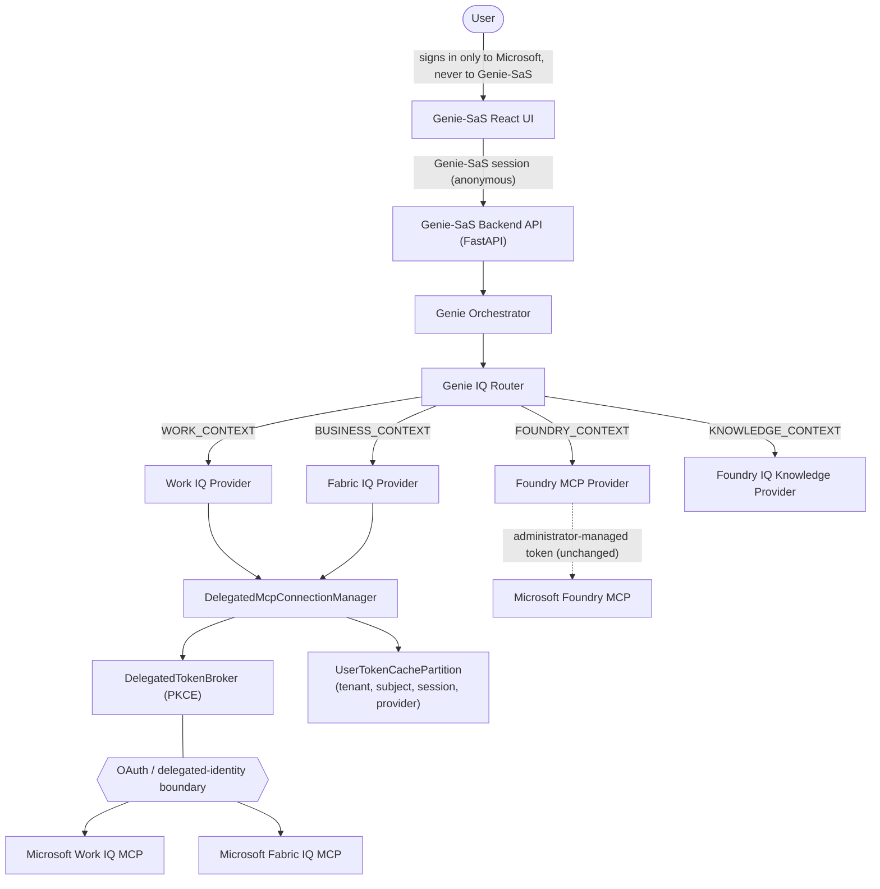

# Genie-SaS Microsoft IQ Architecture (Delegated Authentication)

Genie-SaS is a **standalone web application**. It is not a GitHub Copilot
plugin, and Visual Studio Code / GitHub Copilot are development tools only -
neither is part of the production runtime described in this document.

This document supersedes the authentication model described in the earlier
[`genie-sas-iq.md`](./genie-sas-iq.md) for Work IQ and Fabric IQ: those two
providers now use **delegated Microsoft Entra ID OAuth** (this document),
not an administrator-managed static token. Foundry IQ and Foundry MCP are
unchanged and still documented there.

## 1. Standalone runtime architecture

Key architectural facts, stated explicitly per this document's requirements:

- **Genie-SaS is the MCP client.** Every Work IQ / Fabric IQ / Foundry MCP /
  Foundry IQ call originates from the Genie-SaS FastAPI backend.
- **Visual Studio Code is not part of the runtime.** It is used only to
  develop Genie-SaS; no runtime code depends on it.
- **React never receives a Microsoft access token, refresh token,
  authorization code, or client secret.** The browser only ever sees a
  connection **status** (`IqConnectionStatus`) and a redirect URL to start
  the OAuth flow.
- **IQ requests execute under the signed-in Microsoft user**, not an
  administrator-managed credential, for Work IQ and Fabric IQ.
- **Work IQ and Fabric IQ never fall back to an administrator token,
  application-only authentication, a service principal, or managed
  identity.** If delegated authentication cannot be completed, Genie
  returns an explicit status instead.
- **Every IQ integration is disabled by default** behind a feature flag.

## 2. Genie IQ Router

`app/iq/router.py` (`IQRouter`) maps a capability - never a Microsoft
service name - onto exactly one provider:

| Capability | Provider |
| --- | --- |
| `WORK_CONTEXT` | `work_iq` |
| `BUSINESS_CONTEXT` | `fabric_iq` |
| `KNOWLEDGE_CONTEXT` | `foundry_iq` |
| `FOUNDRY_CONTEXT` | `foundry_mcp` |

(The task that commissioned this work used the names `BUSINESS_DATA_CONTEXT`
and `FOUNDRY_PLATFORM_CONTEXT` for two of these capabilities. Genie-SaS
already implemented equivalent capabilities as `BUSINESS_CONTEXT` and
`FOUNDRY_CONTEXT` in a prior iteration - the semantics are identical; the
existing names were kept to avoid an unnecessary breaking rename across
already-tested code.)

Genie agents (Requirements, Architecture, Coding, Validation) call
`IqEvidenceService.retrieve_by_capability(...)` and never see a tenant id,
OAuth scope, token audience, authorization URL, token URL, access token,
refresh token, or MCP authentication header.

## 3. MCP client

`app/iq/mcp_client.py` (`IqMcpClient`) implements the MCP lifecycle
(`initialize`, `tools/list`, `tools/call`) over JSON-RPC 2.0. It now
supports two token-sourcing modes:

- `token_environment_variable` - the legacy administrator-managed static
  token (Foundry IQ, Foundry MCP only).
- `token_provider` - an async callable returning the *current* valid
  delegated access token, supplied exclusively by
  `DelegatedMcpConnectionManager` for Work IQ / Fabric IQ. The client never
  caches or owns this token itself; it re-resolves it on every call, so a
  concurrent token refresh is always observed.

ASSUMPTION (isolated behind this module): a hand-rolled JSON-RPC/HTTPX
client is used rather than the official `mcp` Python SDK (PyPI: `mcp`),
which was evaluated but not adopted pending verification of its
bearer-token injection point against Genie's per-request, per-provider
token resolution requirement - see "Remaining blockers" below.

## 4. Work IQ

- **Endpoint:** `https://workiq.svc.cloud.microsoft/mcp`
  (`GENIE_WORK_IQ_MCP_ENDPOINT`).
- **Delegated scope (confirmed):** Application ID URI
  `api://workiq.svc.cloud.microsoft`, delegated permission
  `WorkIQAgent.Ask` (admin consent required) → full scope string
  `api://workiq.svc.cloud.microsoft/WorkIQAgent.Ask`. Used as the default
  when `GENIE_WORK_IQ_SCOPES` is unset.
- **Tools:** the 10 generic Work IQ MCP tools
  (`fetch`/`create_entity`/`update_entity`/`delete_entity`/`do_action`/
  `call_function`/`ask`/`list_agents`/`get_schema`/`search_paths`),
  discovered at runtime via `tools/list` - never hardcoded.
- **Authentication:** delegated Microsoft Entra ID only. Microsoft's
  documentation states no application-only path exists.
- **Failure handling:** `AUTHENTICATION_REQUIRED` / `CONSENT_REQUIRED` /
  `PERMISSION_DENIED` are returned explicitly, never worked around.

## 5. Fabric IQ

- **Endpoint:** `https://fabriciq.svc.cloud.microsoft/v1/mcp/fabriciq`
  (private-link tenants: `https://api.fabric.microsoft.com/v1/mcp/fabriciq`)
  - `GENIE_FABRIC_IQ_MCP_ENDPOINT`.
- **Delegated permissions (confirmed):** Power BI Service API
  `Item.Read.All`, `Item.Execute.All`, `Dataset.Read.All`. The exact scope
  *strings* depend on how the administrator exposed these permissions in
  Genie-SaS's own Entra app registration, so `GENIE_FABRIC_IQ_SCOPES` has
  no default - it is required configuration, confirmed against the app
  registration's exposed API permissions.
- **Behavior:** read-only Power BI content discovery, report/model
  metadata, value search, and DAX query execution. Fabric IQ preserves the
  caller's existing row-level and object-level security - Genie never sees
  more than the connected user already can.
- **Authentication:** delegated OAuth 2.0 only. Microsoft's documentation
  states explicitly that service-principal and application-only
  authentication are **not supported**.

## 6. Microsoft Foundry MCP

- **Endpoint:** `https://mcp.ai.azure.com` (public preview).
- **Status: unchanged, disabled by default.** Microsoft's own
  authentication guide for Foundry-hosted agents documents "OAuth identity
  passthrough" as the option that preserves per-user identity - but that
  passthrough is a Foundry *agent* configuring its own call to *another*
  MCP server, not a documented pattern for a standalone backend acting as a
  direct MCP client of `https://mcp.ai.azure.com` itself. No headless
  backend integration path for Genie-SaS is confirmed. Enabling it is out
  of scope for this delegated-OAuth change (the commissioning task scoped
  delegated OAuth to Work IQ and Fabric IQ only) and remains a documented
  follow-up.

## 7. Foundry IQ

Unchanged from the prior iteration: configuration-driven (project
endpoint, knowledge-base identifier, connection name, tool identifier),
using the existing administrator-managed token pattern
(`GENIE_FOUNDRY_IQ_TOKEN_ENV_VAR`). `NOT_CONFIGURED` is returned when no
knowledge base is configured. Citations are preserved verbatim.

## 8. Delegated OAuth / PKCE design

Genie-SaS does not implement a classic On-Behalf-Of (OBO) flow (which
would require Genie-SaS itself to be a protected resource whose token gets
exchanged for a second token). Instead, it implements the pattern
Microsoft's own documented clients (VS Code, GitHub Copilot CLI) use:
**direct delegated authorization-code + PKCE against the target
resource**, discovered per the MCP Authorization specification
(https://modelcontextprotocol.io):

1. `GET {mcp origin}/.well-known/oauth-protected-resource{resource path}`
   → discovers the authorization server(s) protecting the resource. Per
   RFC 9728 (OAuth 2.0 Protected Resource Metadata) §3.1, the well-known
   path segment is inserted before the resource's own path (e.g. Work
   IQ's `/mcp`), never replacing it - confirmed live against Microsoft's
   real Work IQ MCP server during development validation; see
   [`docs/validation/work-iq-development-validation.md`](../validation/work-iq-development-validation.md)
   for the defect this corrected.
2. `GET {authorization_server}/.well-known/oauth-authorization-server`,
   falling back to the standard OIDC
   `/.well-known/openid-configuration` document Microsoft Entra ID's v2
   issuer serves - discovers `authorization_endpoint` / `token_endpoint` /
   `jwks_uri`.
3. Standard OAuth 2.0 authorization-code + PKCE (S256) against those
   endpoints, using Genie-SaS's own confidential-client Entra app
   registration (client id + Key-Vault-backed client secret + redirect
   URI - all externally configured, never hardcoded).
4. The returned ID token is RS256-signature-validated (via the discovered
   `jwks_uri`) purely to extract `tid` (tenant)/`oid` (subject)/`name`
   claims - never to authenticate a Genie-SaS API request.

### Why this instead of OBO

A classic OBO flow requires the calling application (Genie-SaS) to itself
be a registered, audience-checked resource that the user first
authenticates *to*, so that token can be exchanged for a second,
downstream-scoped token. Genie-SaS is intentionally anonymous for its own
API (see the root `README.md` "Authentication" and its documented
decision history) - it deliberately does not want to become a protected
resource users must sign in to. Direct delegated authorization-code+PKCE
against Work IQ/Fabric IQ achieves the same "acts under the signed-in
user's identity and permissions" guarantee without requiring Genie-SaS
itself to gain a first-class authenticated-user concept.

### Components (`app/iq/`)

| Component | File | Responsibility |
| --- | --- | --- |
| `DelegatedIdentityContext` | `models.py` | Stable identifiers only (session id, tenant id, subject, correlation id) - never a token. |
| `MicrosoftMcpResourceRegistry` | `microsoft_resource_registry.py` | Confirmed, non-secret endpoint + scope metadata per provider. |
| `DelegatedTokenBroker` | `delegated_token_broker.py` | PKCE challenge generation, `.well-known` discovery, authorization-code exchange, refresh, ID-token validation, error classification. |
| `UserTokenCachePartition` | `token_cache.py` | In-memory token cache partitioned by `(tenant_id, subject, session_id, provider)`. |
| `PendingOAuthFlowStore` | `pending_oauth_flow.py` | Short-lived, single-use, CSRF-resistant `state` → `(session_id, provider, code_verifier)` binding for the redirect round trip. |
| `DelegatedMcpConnectionManager` | `delegated_connection_manager.py` | Resolves a ready `IqMcpClient` per identity/provider; transparent refresh; disconnect/logout cleanup. |
| `SessionIdentityIndex` | `session_identity_index.py` | Non-secret session→identity lookup for status reporting and connection resolution. |
| `DelegatedConnectionService` | `delegated_connection_service.py` | Application service backing the API routes: start, callback, status, disconnect. |
| `DelegatedAuthError` | `delegated_token_broker.py` | Structured error carrying only a category - never a token. |

## 9. Per-user and per-tenant isolation

Every token read/write is partitioned by the full
`(tenant_id, subject, session_id, provider)` tuple:

- **Tenant isolation:** the ID token's `tid` claim must equal the
  configured `GENIE_IQ_OAUTH_TENANT_ID` or the exchange is rejected with
  `TENANT_MISMATCH` - a token for the wrong tenant is never cached.
- **User isolation:** `subject` is the Entra `oid` (stable across token
  refreshes), never a mutable UPN/email.
- **Session isolation:** a token is bound to the exact Genie session that
  initiated the connect flow (via the `state` → `PendingOAuthFlow`
  binding) - no other session can read it.
- **Resource isolation:** Work IQ and Fabric IQ tokens for the same
  user/session never share a cache entry.
- **No cross-user cache reuse:** verified directly in
  `tests/unit/test_token_cache.py` and
  `tests/unit/test_delegated_connection_manager.py`.
- **Logout/session-termination cleanup:**
  `DelegatedConnectionService.clear_session(session_id=...)` clears every
  delegated connection (token + identity) for one Genie session. Genie-SaS
  does not currently have a dedicated logout/session-termination API route
  (see "Remaining blockers") - this method is implemented, tested, and
  ready to be called once one exists; the explicit per-provider
  **Disconnect** action is already wired into the UI and API today.

## 10. Permission model

Each Microsoft service enforces its own permission boundary independent of
Genie-SaS:

- Work IQ applies Microsoft 365 permission trimming per the signed-in
  user's actual access.
- Fabric IQ continues to enforce Power BI row-level security (RLS) and
  object-level security (OLS) for the connected user.
- Genie-SaS never attempts to widen, cache past expiry, or bypass either
  boundary.

## 11. Consent experience

- The first time a user's tenant uses `WorkIQAgent.Ask`, a Microsoft Entra
  administrator must grant admin consent for that permission (per
  Microsoft's own documentation, `AdminConsentRequired: Yes`).
- Fabric IQ's three Power BI Service API delegated permissions are
  likewise subject to the tenant's configured consent policy.
- If Microsoft returns `consent_required`/`interaction_required` during
  token exchange, Genie-SaS surfaces `CONSENT_REQUIRED` explicitly (see
  `DelegatedTokenBroker._raise_for_token_error_response`) - it never
  silently retries or falls back.

## 12. Tool approval

`app/iq/tool_classification.py` classifies every discovered MCP tool into
`read_only` / `data_querying` / `configuration_changing` /
`resource_creating` / `resource_deleting` / `permission_changing` /
`unknown`, primarily from the tool's official MCP annotations
(`readOnlyHint`/`destructiveHint`/`idempotentHint`), with a generic,
provider-agnostic verb-prefix heuristic as a secondary signal when
annotations are absent. `requires_approval(...)` returns `True` for every
class except `read_only` and `data_querying` - including `unknown` - per
"if mutation behavior cannot be established, default to approval
required." This module is infrastructure ready for any future
generic/mutating tool call; the current evidence-retrieval use case only
ever invokes one configured, provider-owned "retrieve" tool per request.

## 13. Feature flags

All IQ capabilities remain **disabled by default**:

| Flag | Default |
| --- | --- |
| `GENIE_WORK_IQ_ENABLED` | `false` |
| `GENIE_FABRIC_IQ_ENABLED` | `false` |
| `GENIE_FOUNDRY_MCP_ENABLED` | `false` |
| `GENIE_FOUNDRY_IQ_ENABLED` | `false` |

A separate safety flag additionally gates delegated OAuth in production:
`GENIE_IQ_DELEGATED_OAUTH_ALLOWED_IN_PRODUCTION` (default `false`) must be
explicitly `true`, in addition to full OAuth client configuration, before
`ConfigurationValidator` allows `work_iq`/`fabric_iq` to be enabled with
`GENIE_ENVIRONMENT=production`.

## 14. Logging and redaction

- `CachedDelegatedToken` and `ExchangedDelegatedToken` both override
  `__repr__`/`__str__` to print `***redacted***` in place of the access
  and refresh token, as defense in depth against an accidental
  `logger.info(str(token))` or an unredacted exception traceback -
  verified by `test_token_cache.py::test_repr_and_str_never_include_the_raw_token_value`.
- Every `DelegatedAuthError` message is a static, safe string - never
  interpolates a token or client secret.
- Governance audit events for connect/disconnect
  (`record_tool_request(tool_name="{provider}.delegated_connect", ...)`)
  record only `tenant_id` - never the access token, refresh token,
  authorization code, or client secret - verified by
  `test_delegated_connection_service.py::test_callback_then_status_reports_available_and_records_a_redacted_audit_event`.

## 15. Local development

1. Register a single-tenant confidential-client Entra application (no
   default is provided - this must be created by a tenant administrator).
2. Add a redirect URI matching `GENIE_IQ_OAUTH_REDIRECT_URI` (your local
   backend's `/iq/connections/callback` route).
3. Set `GENIE_WORK_IQ_ENABLED=true` and/or `GENIE_FABRIC_IQ_ENABLED=true`,
   plus the full OAuth + endpoint configuration block (see
   "Configuration" below).
4. Start Genie-SaS normally (`GENIE_ENVIRONMENT=development`) - Genie-SaS
   itself still requires no sign-in; only the new "Connect Microsoft 365"
   action on the IQ Collaboration page triggers the Microsoft sign-in
   redirect.

## 16. Testing

All automated tests mock the MCP/OAuth transport - **none contact a live
Microsoft service.** A real RS256 keypair is generated in-test so ID-token
signature validation is exercised cryptographically, not stubbed out.

| File | Covers |
| --- | --- |
| `tests/unit/test_tool_classification.py` | Annotation-based and name-heuristic classification; unknown always requires approval. |
| `tests/unit/test_token_cache.py` | Partition isolation (tenant/subject/session/provider), clear/clear_session, token redaction. |
| `tests/unit/test_pending_oauth_flow.py` | Single-use state, expiry, no collision across concurrent flows. |
| `tests/unit/test_delegated_token_broker.py` | PKCE correctness, discovery chain, ID-token validation, tenant-mismatch rejection, `consent_required`/`invalid_grant`/403 classification. |
| `tests/unit/test_delegated_connection_manager.py` | End-to-end isolation, transparent refresh, refresh-failure cache invalidation, disconnect/logout cleanup, concurrent-refresh visibility. |
| `tests/unit/test_delegated_connection_service.py` | Session-ownership enforcement, disabled-provider rejection, per-session status, redacted audit trail. |
| `tests/unit/test_iq_evidence_service.py` | Delegated retrieve path (connected/not-connected), session-less status never claims `IQ_AVAILABLE` for a delegated provider, untrusted-content-is-opaque (prompt-injection resistance). |
| `frontend/tests/iq_connections_api.test.ts` | Start-URL construction never contains a token. |
| `frontend/tests/iq_collaboration_connect.test.tsx` | Connect navigates the whole page; redirect-return banner; disconnect. |

Live/opt-in integration testing against a real Microsoft tenant is **not
implemented** in this change and must remain excluded from default CI -
see "Remaining blockers."

## 17. Deployment prerequisites

- A single-tenant Entra confidential-client app registration (client id +
  Key-Vault-backed client secret + exact redirect URI).
- `GENIE_IQ_OAUTH_TENANT_ID`, `GENIE_IQ_OAUTH_CLIENT_ID`,
  `GENIE_IQ_OAUTH_CLIENT_SECRET_ENV_VAR`, `GENIE_IQ_OAUTH_REDIRECT_URI`.
- For Fabric IQ: `GENIE_FABRIC_IQ_SCOPES` populated from this app
  registration's actual exposed Power BI Service API permissions.
- HTTPS is enforced for `iq_oauth_redirect_uri` and every provider
  endpoint.

## 18. Admin-consent prerequisites

- A tenant administrator must [enable Work IQ](https://learn.microsoft.com/en-us/microsoft-365/copilot/extensibility/work-iq/enable-work-iq)
  for the tenant before `WorkIQAgent.Ask` can be used.
- A tenant administrator must grant admin consent for `WorkIQAgent.Ask`
  (confirmed `AdminConsentRequired: Yes`).
- A tenant administrator must approve the Power BI Service API delegated
  permissions this app registration requests for Fabric IQ.

## 19. Troubleshooting

| Symptom | Likely cause |
| --- | --- |
| `GET /sessions/{id}/iq/connections` returns 503 | No delegated provider is enabled (`GENIE_WORK_IQ_ENABLED`/`GENIE_FABRIC_IQ_ENABLED` both `false`). |
| Status is `IQ_AUTHENTICATION_REQUIRED` after clicking Connect | The redirect round trip did not complete - check the `iq_connect` query parameter Genie's callback attaches. |
| Status is `IQ_CONSENT_REQUIRED` | A tenant administrator has not granted consent for the requested scope yet. |
| Status is `IQ_TENANT_MISMATCH` | The signed-in Microsoft account belongs to a different tenant than `GENIE_IQ_OAUTH_TENANT_ID`. |
| Status is `IQ_SESSION_EXPIRED` | The refresh token was rejected (`invalid_grant`) - reconnect. |
| `503` from `/iq/connections/{provider}/start` | Provider not enabled, or OAuth client configuration incomplete - see `ConfigurationValidator`. |

## 20. Preview limitations

- Microsoft Foundry MCP (`https://mcp.ai.azure.com`) is explicitly
  documented as public preview and is **not enabled** by this change.
- Fabric IQ's exact delegated scope strings are administrator-confirmed
  configuration, not a Genie-owned default, because Microsoft's public
  documentation names the required permissions without publishing a fixed
  scope-string constant for third-party app registrations.

## 21. Remaining blockers

- **No Entra app registration exists yet** and no real Work IQ
  connection has been completed end to end - see
  [`docs/validation/work-iq-development-validation.md`](../validation/work-iq-development-validation.md)
  for exactly what was and was not verified live, and
  [`docs/setup/genie-sas-entra-development.md`](../setup/genie-sas-entra-development.md)
  for the registration checklist.
- **In-memory-only token cache and pending-flow store.** A persistent
  (Cosmos-backed) token cache requires an explicit encryption-at-rest
  design not implemented in this change; documented as a follow-up.
  Multi-replica deployments must route a callback to the same replica that
  issued `state`, or use a shared pending-flow store.
- **No dedicated logout/session-termination route** exists in Genie-SaS
  today; `DelegatedConnectionService.clear_session(...)` is implemented
  and tested, ready to be wired to one when it exists.
- **`offline_access` is not requested**, so a real connection's access
  token will not transparently refresh once it expires - see the Entra
  checklist's "Additional OpenID Connect scopes" section.
- **The official `mcp` Python SDK was not adopted** this iteration -
  `IqMcpClient` remains a hand-rolled JSON-RPC/HTTPX client.
- **No live/opt-in integration test** against a real, fully connected
  Microsoft tenant was added; only mocked-transport unit tests exist, plus
  one development validation session that verified live discovery/redirect
  behavior up to (but not including) interactive sign-in.
- **Microsoft Foundry MCP remains unconfirmed** for headless backend use
  and stays disabled.

## 22. Official Microsoft references

- [Work IQ API overview](https://learn.microsoft.com/en-us/microsoft-365/copilot/extensibility/work-iq/api-overview)
- [Work IQ API permissions reference](https://learn.microsoft.com/en-us/microsoft-365/copilot/extensibility/work-iq/permissions)
- [Work IQ A2A / server-side OBO quickstart](https://learn.microsoft.com/en-us/microsoft-365/copilot/extensibility/work-iq/a2a/quickstart)
- [Work IQ MCP overview](https://learn.microsoft.com/en-us/microsoft-365/copilot/extensibility/work-iq/mcp/overview)
- [Work IQ MCP tool reference](https://learn.microsoft.com/en-us/microsoft-365/copilot/extensibility/work-iq/mcp/tool-reference)
- [Fabric IQ MCP](https://learn.microsoft.com/en-us/fabric/iq/connectors/fabric-iq-mcp)
- [Foundry MCP get started](https://learn.microsoft.com/en-us/azure/foundry/mcp/get-started)
- [Foundry MCP server authentication](https://learn.microsoft.com/en-us/azure/foundry/agents/how-to/mcp-authentication)
- [Foundry Toolbox tool authentication](https://learn.microsoft.com/en-us/azure/foundry/agents/how-to/tools/tool-authentication)
- [Connect agents to Foundry IQ knowledge bases](https://learn.microsoft.com/en-us/azure/foundry/agents/how-to/foundry-iq-connect)
- [Model Context Protocol](https://modelcontextprotocol.io)
